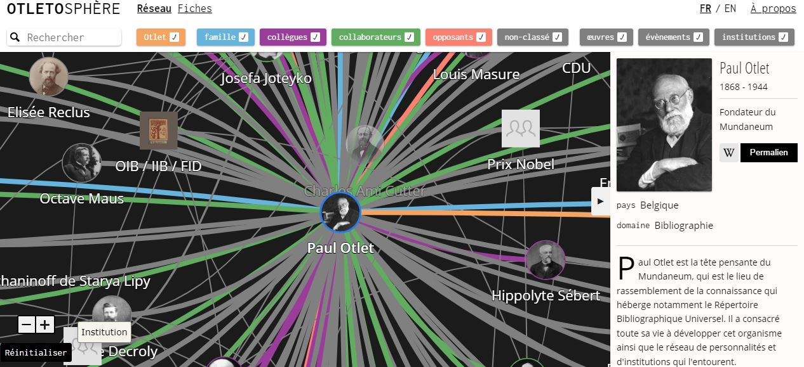

# Présentation du Logiciel Cosma
Olivier Le Deuff.
*Licence CC By*
2023

---

# À propos de Cosma

---

## Historique

Cosma a été créé pendant le programme de recherche [HyperOtlet](https://hyperotlet.hypotheses.org/) (2017-2022; numéro de subvention ANR-17-CE38-0011). Il a été imaginé par Arthur Perret, dans le cadre de sa recherche doctorale sous la direction de Bertrand Müller et Olivier Le Deuff, et développé par Guillaume Brioudes.

---

## Otletosphere

En 2018 et 2019, Olivier Le Deuff a dirigé un projet de cartographie nommé [Otletosphere](https://hyperotlet.huma-num.fr/otletosphere/), avec la version 2 développée par Guillaume  Brioudes alors étudiant en *LP MIND* qui est un peu l'ancêtre du *BUT 3 Infonum*.

---

## Point de départ

En 2020, Arthur a défié Guillaume de construire un prototype basé sur le code source d'Otletosphere pour visualiser sa documentation de recherche sous forme de réseau interactif. C'est le point de départ de ce qui est devenu Cosma.
Il s'agit donc d'une *innovation ascendante* non prévue initialement dans le programme de recherche.

---

## Nom "Cosma"

Nous avons emprunté le nom "Cosma" à **Cosma Rosselli**, l'auteur d'un *Thesaurus artificiosæ memoriæ* (1579), que nous pouvons traduire approximativement par "trésor de mémoire artificielle" - une manière poétique de décrire une aide à la mémoire.
La référence à ce travail est décrite notamment par *Umberto Eco* dans son ouvrage *De l'arbre au labyrinthe.*

---

## Outils de rédaction non linéaires

Il existe de nombreux outils de rédaction non linéaires, y compris une récente vague d'"outils pour la pensée" qui utilisent la visualisation, tels que [Roam](https://roamresearch.com/) et [Obsidian](https://obsidian.md/).

---

## Qu'est-ce que Cosma?

La plupart de Cosma est constituée d'idées et de techniques préexistantes (hypertexte, visualisation graphique, backlinks...), avec deux choix peu communs qui définissent l'identité du programme.

---

## Pas un éditeur de texte

Premièrement, Cosma n'est pas une application de prise de notes. Il n'y a pas d'éditeur de texte. Cosma ne lit que les fichiers et génère une visualisation de ces fichiers et de leurs connexions.
- Mais il est compatible avec des éditeurs de notes de type *markdown* comme *Zettlr* qui a été le modèle de base et qui est le logiciel conseillé pour travailler avec Cosma.

---

## Une application dans une application

Le choix peu commun que nous avons fait concerne l'architecture de Cosma. En tant qu'utilisateur, vous installez un programme appelé `cosma`, qui a une interface en ligne de commande. Vous utilisez ensuite ce programme pour générer un fichier HTML, le *cosmoscope*, qui se comporte comme une application autonome.

---

## Pour qui est-ce?

Cosma est une interface pour des données de type *wiki*, la présentant d'une manière qui aide à analyser, synthétiser et partager l'information. Tout travail de connaissance qui implique de décrire des choses et les relations entre elles peut utiliser Cosma.

---

## Licence

Cosma est disponible gratuitement, et son code est librement réutilisable sous les conditions autorisées par la licence GNU GPL 3.0.

---

## Pour citer Cosma

Arthur Perret, Guillaume Brioudes, Clément Borel, & Olivier Le Deuff. (2021). Cosma. Zenodo. [https://doi.org/10.5281/zenodo.5920615](https://doi.org/10.5281/zenodo.5920615)

# Utilisations courantes

Cosma peut être utilisé pour :
- Analyse de données
- Exploration de données
- Présentation de données
- Enseignement et formation

---
Cosma est utilisé par les enseignants, étudiants, chercheurs, bibliothécaires, designers, journalistes... Tout travail de connaissance impliquant la description des choses et des relations entre elles peut utiliser Cosma.

---

## À propos des exemples

Les exemples interactifs liés sur cette page sont appelés "cosmoscopes". Ce sont des fichiers HTML autonomes, donc ils peuvent être partagés et utilisés tels quels : vous avez seulement besoin d'un navigateur web pour les ouvrir.

---

## Création d'un glossaire hypertextuel

Un glossaire peut être une ressource inestimable pour les nouveaux venus et les professionnels établis dans n'importe quel domaine, fournissant un vocabulaire partagé avec des définitions.

---

## Étudier un réseau de relations sociales

Lorsque vous travaillez sur un sujet, vous commencez souvent par une liste, puis passez soit à des tableaux (dans un tableur, une base de données) soit à des diagrammes (comme des cartes mentales).

---

## Recherche sur un sujet complexe

La recherche implique généralement de rassembler des matériaux, de prendre des notes à leur sujet et de forger de nouvelles idées.

---

## Un outil pour la connaissance

Cosma encourage le travail de connaissance. Classifiez les choses en utilisant des types et des mots-clés : Cosma vous donnera des moyens de navigation (couleurs, filtres). Engagez-vous avec des concepts et de la littérature : Cosma vous donne des rétroliens contextualisés pour vous rappeler des idées passées, vous aidant à créer de nouvelles idées.

---
# Références et crédits

- Eco, Umberto. *De l’arbre au labyrinthe. Études historiques sur le signe et l’interprétation*. Grasset, 2010. 978-2-246-74851-9.
- Perret, Arthur. [*About Cosma*](https://cosma.arthurperret.fr/about.html)
- Perret, Arthur.[*Examples*](https://cosma.arthurperret.fr/examples.html)
