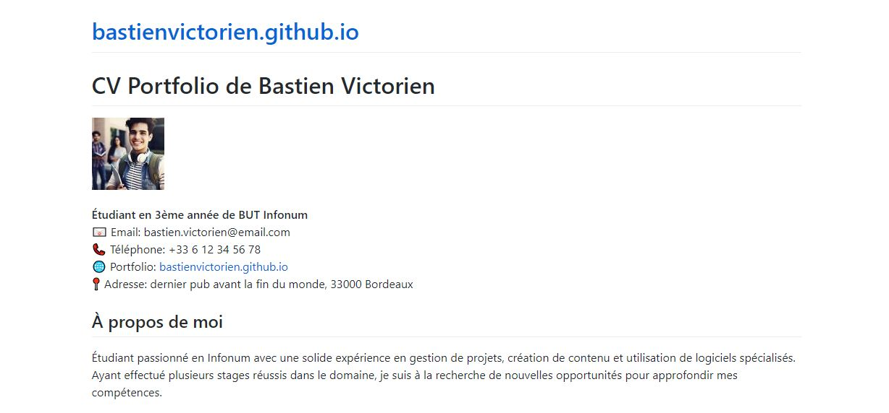
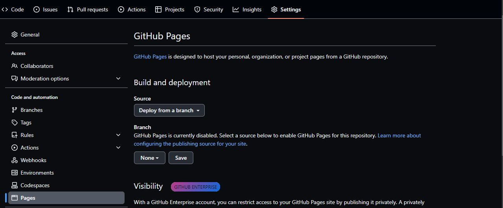
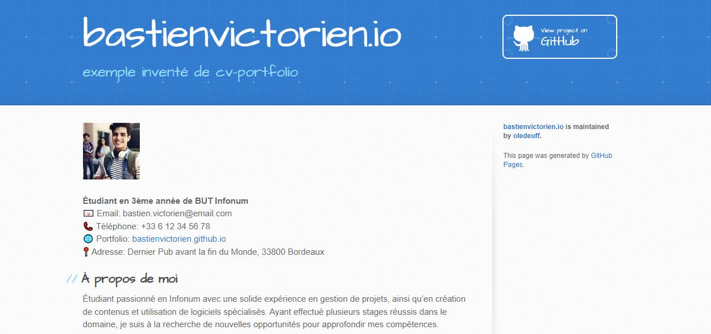

# Création d'un Portfolio CV pour un Étudiant en Information-Communication sur GitHub Pages


Vous pouvez trouver un exemple de *Cv-portfolio* très simple généré par GIthub pages ici avec [cet exemple](https://bastienvictorien.github.io) 



## Introduction
GitHub Pages est un excellent moyen pour les étudiants en information-communication de présenter leurs compétences, projets et expériences professionnelles. 
Dans ce tutoriel, nous allons voir comment créer un portfolio CV simple à partir de pages écrites en Markdown.


## Étape 1: Créer un compte GitHub
Si vous n'avez pas encore de compte GitHub, rendez-vous sur GitHub.com et inscrivez-vous gratuitement.

## Étape 2: Créer un nouveau dépôt (repository)
Une fois connecté, cliquez sur le bouton + en haut à droite et sélectionnez New repository.
Nommez votre dépôt username.github.io (remplacez username par votre nom d'utilisateur GitHub).
Cochez la case Initialize this repository with a README.
Cliquez sur *Create repository*.


## Étape 3: Écrire votre CV en Markdown
Dans votre dépôt, cliquez sur Add file puis Create new file.
Nommez le fichier index.md.
Commencez à écrire votre CV en utilisant la syntaxe Markdown. Voici un exemple simple:
```\markdown
# Prénom Nom

## À propos de moi
Étudiant(e) passionné(e) en information-communication, je suis spécialisé(e) en...

## Formation
- **2023:** Master en Information-Communication, Université XYZ.
- **2021:** Licence en Communication, Université ABC.

## Expériences professionnelles
- **2022:** Stage chez [Nom de l'entreprise](#), description...

## Compétences
- Communication digitale
- Rédaction web
- ...

## Contact
- Email: exemple@email.com
- LinkedIn: [Mon LinkedIn](https://www.linkedin.com/in/monprofil/)

```

Une fois terminé, cliquez sur Commit changes.

## Étape 4: Activer GitHub Pages
Dans votre dépôt, allez dans l'onglet *Settings*.
Faites défiler jusqu'à la section *GitHub Pages*.
Dans Source, sélectionnez *main branch*.
Cliquez sur *Save*.



## Étape 5: Vérifier votre Portfolio CV
Ouvrez un nouvel onglet de navigateur et allez à l'adresse https://username.github.io (remplacez username par votre nom d'utilisateur GitHub). Vous devriez voir votre CV en ligne!
Attention, cela peut prendre quelques minutes que le déploiement se fasse.

Pour notre étudiant Bastien Victorien, son CV-portfolio est accessible [ici](https://bastienvictorien.github.io)


Félicitations! Vous avez maintenant un portfolio CV en ligne hébergé sur GitHub Pages. N'hésitez pas à personnaliser davantage votre CV, à ajouter d'autres pages ou à explorer d'autres thèmes pour le rendre encore plus attrayant. 


# Partie 2: Utiliser un Thème pour votre Portfolio CV sur GitHub Pages

Après avoir créé votre portfolio CV de base, il est temps de le rendre plus attrayant en utilisant un thème. GitHub Pages offre une variété de thèmes Jekyll que vous pouvez facilement appliquer à votre site.

Par exemple, vous pouvez retrouver une [nouvelle version du CV de Bastien Victorien](https://oledeuff.github.io/bastienvictorien.io/) avec un thème jekyll qui est appliqué.



## Étape 1: Sélectionner un Thème

1. Dans votre dépôt, allez dans l'onglet `Settings`.
2. Faites défiler jusqu'à la section `GitHub Pages`.
3. Cliquez sur `Learn how to add a Jekyll theme to your site'.

Vous serez redirigé vers une page avec une sélection de thèmes. Prenez le temps de parcourir les différents thèmes disponibles et choisissez-en un qui vous plaît.

## Étape 2: Appliquer le Thème

1. Une fois que vous avez trouvé un thème qui vous plaît, cliquez dessus.
2. Vous verrez un aperçu de ce à quoi ressemblera votre site avec ce thème. Si cela vous convient, cliquez sur `Select theme`.
Vous arrivez sur une [page explicative] (https://docs.github.com/fr/pages/setting-up-a-github-pages-site-with-jekyll/adding-a-theme-to-your-github-pages-site-using-jekyll)
 Suivez les instructions et veillez à la bonne configuration de  `_config.yml` dans votre dépôt avec le nom du thème que vous avez choisi.

## Étape 3: Personnaliser le Thème

La plupart des thèmes offrent une variété d'options de personnalisation, telles que la modification des couleurs, des polices ou de la mise en page. Pour personnaliser votre thème:

1. Ouvrez le fichier `_config.yml` dans votre dépôt.
2. Ajoutez ou modifiez les paramètres selon vos préférences. Par exemple, pour changer la couleur principale ou la police, vous pourriez ajouter:

\```yaml
color: "#FF5733"
font: "Arial, sans-serif"
\```

(Notez que les options exactes dépendront du thème que vous avez choisi.)

3. Enregistrez vos modifications en cliquant sur `Commit changes`.

## Étape 4: Vérifier les Modifications

Retournez à l'adresse `https://username.github.io` (remplacez `username` par votre nom d'utilisateur GitHub) pour voir à quoi ressemble votre portfolio CV avec le nouveau thème.

## Étape 5: ajouter des pages

Vous pouvez ajouter des pages, par exemple une page consacrée à des réalisations. 
Le but est alors de lier votre *CV* classique à une page de preuves avec des réalisations.
Le fait de pouvoir également relier votre *cv* à un espace Github permet aussi de donner à voir le travail que vous avez effectué sur les dépôts.
Pour vraiment utiliser la pleine puissance du système, il faut utiliser le système GIT et notamment *Github Desktop*.