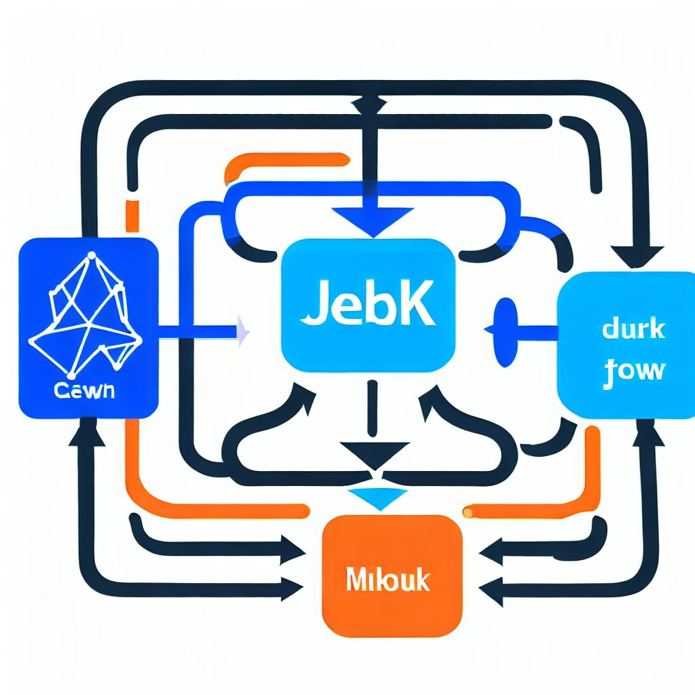
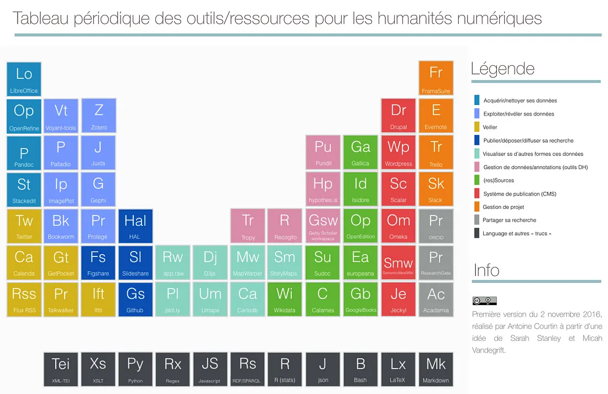
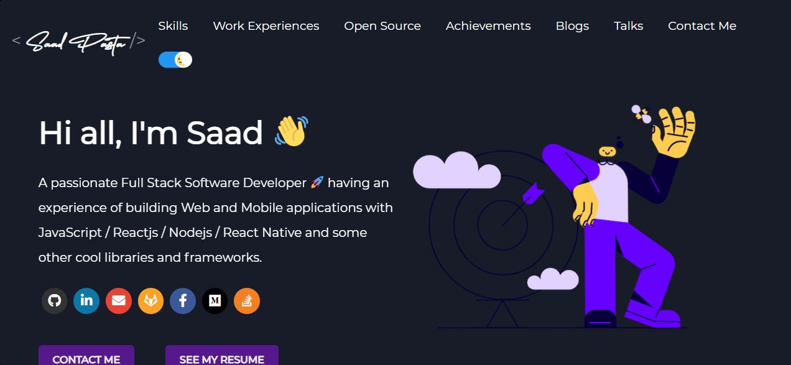
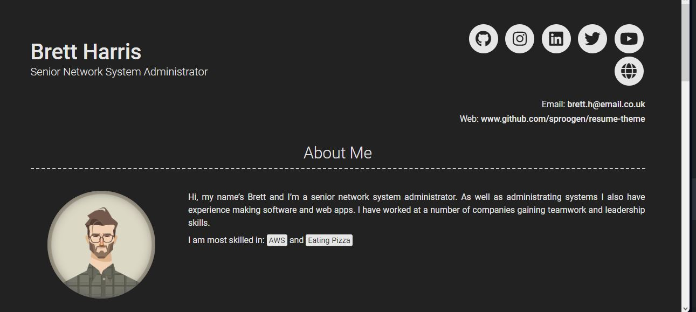

# Portfolio
Cours *BUT INFONUM 3*
Olivier Le Deuff

**Licence CC By**

---
## Un portfolio pour quoi faire ?
- Pour avoir un cv original
- Pour associer des réalisations
- Pour démontrer des savoir-faire
 <!-- Setting width to 200px -->
----
## Documenter ses compétences
- Il ne s'agit plus de déclarer
- Il s'agit de donner à voir
- Il faut rendre consultable

---
## Démontrer plutôt que prétendre
- Au-delà du diplôme
- La prime à la capacité de réalisation.
- Lier la *compétence* déclarée à une *preuve*

---

## Un esprit issu de l'informatique
- Notamment le monde de l'Open Source
- une logique de méritocratie.
- Offrir, Ouvrir
- Logique du don

---
## Le réseau Github
- Un réseau basé sur GIT
    - qui permet de gérer des projets collaboratifs au niveau informatique
    - logiciel libre qui peut être réutilisé et déployé.
        ex: Gitlab
- Un réseau social de projets et de profils
    - racheté par Microsoft

---
## Github et les profils de compétences
- Plus on collabore...
- Plus ça enrichit son profil
- Plus on démontre des compétences
- Plus on devient "attractif" sur le marché de l'emploi.

---
## Investir Github
- Adopter les bons réflexes
- Se départir des outils clefs en main
- Apprendre des langages et des méthodes
- Mieux organiser ses données
  
---
## Github comme portfolio ?
1. Développer son profil Github :
    - les actions réalisées sont consignées via la dynamique d'activité
    - On peut voir les actions réalisées (avec quel langage, etc.)
    - Met en avant une forme d'expertise.
  
---
## Github comme portfolio ?
2. Utiliser Github-Pages
    - pour héberger sa page perso et son CV portfolio
    - des outils dédiés à personnaliser
    - Relier son espace Github à son CV-Portfolio

---
## Transformer son portfolio
- En contenu dynamique facilement mis à jour
- En espace de consultation de ses réalisations.

---
## Imaginer des formes graphiques
- originales comme un tableau des compétences 
    à la Mendeleiev !
    * voir le [*billet*](https://medium.com/@seeksanusername/tableau-périodique-des-outils-ressources-pour-les-humanités-numériques-43da3f5ff9ff) d'Antoine Courtin
    

---
## Un exemple d'un portfolio développeur

---
## Un exemple plus léger

---
## Faire évoluer le projet 
- Tout au long de l'année
 - suivant votre progression
 - vos projets professionnels
 - vos découvertes et inspirations. 

---
## S'inspirer, forker, innover
- Github recense pleins de [projets](https://github.com/topics/portfolio-template)
- A vous de jouer et de sortir de Canva !

---
## Hacker, transformer...
- Github permet d'héberger des pages web dans votre espace
- Possibilité de générer automatiquement un site
    - en flat CMS avec *jekyll*
    - il suffit suivre quelques consignes.
- Tout est possible ou presque.

--- 
## Philosophie
- Il faut accepter de perdre du temps 
    - pour apprendre
    - pour obtenir plus de satisfaction personnelle
    - pour devenir plus compétent.
    - pour développer une communication plus durable
    - pour *gagner du temps* sur le *long terme*
---
## Crédits
- images slides: Dall-E via Bing Create.
- *Licence CC By.*
- Image du tableau de compétences : Antoine Courtin. 2016.