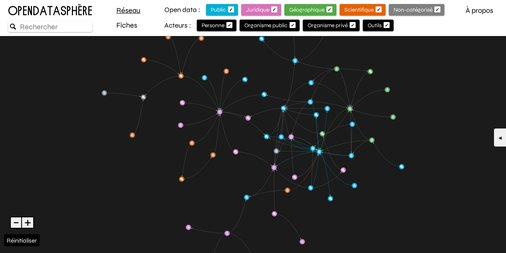

# Entrez dans le **cosmos de l'Open Data**
## Utilisation du logiciel **Cosma** dans un projet de structuration et de visualisation de données.

Projet sous la direction d'*Olivier Le Deuff*

## Objectifs
Vous avez entendu parler de l'**open data** mais tout cela vous paraît encore un peu obscur ?
Ce projet va être l'occasion d'y voir un peu plus clair sur les enjeux et acteurs qui composent ce monde de l'open data.
L'objectif du projet est double *thématiquement*.
Il s'agit :
- [ ] Comprendre ce qu'est l'open data, le vocabulaire qu'il recouvre et les acteurs impliqués.
- [ ] Mieux saisir le rôle des acteurs publics, des institutions et notamment des collectivités locales.

Les connaissances acquises durant le projet seront réinvesties dans les projets suivants notamment le *projet d'exposition* mais aussi le *challenge de la data*. D'une manière plus large, toutes ces compétences seront réutilisées dans des cours du semestre 6 notamment le cours, *projet en Architecture de l'information*.

Le projet est également l'occasion de monter en puissance au *niveau technique* et d'apprendre quelques techniques et logiciels qui permettront d'organiser et structurer l'information et de pouvoir la visualiser. Il s'agira donc d'apprendre :
- [ ] Le format d'écriture simplifié Markdown
- [ ] L'emploi d'un logiciel dédié pour la rédaction de fiches Markdown : **Zettlr**
- [ ] L'utilisation d'un logiciel conçu par l'équipe de recherche E3D du Mica : **Cosma**
- [ ] Apprendre à documenter les actions réalisées en produisant un travail explicatif qui devra être diffusé en ligne.
- [ ] L'utilisation  d'espaces collaboratifs qui permettent de partager du code comme **Github**.
- [ ] L'application de principes vues en cours d'architecture de l'information
- [ ] Mobiliser des compétences web notamment avec le CSS.
- [ ] A utiliser **Zotero** de façon compatible avec un autre logiciel comme Cosma.
- [ ] A mieux saisir l'importance des formats de données.

## Missions

Réaliser la mise à jour d'un travail précédent : l'*open data sphère*.

Ce travail avait été effectué dans le cadre de l'ancienne LP MIND sous la direction d'Arthur Perret avec l'ancêtre du logiciel Cosma : l'otletosphère-opensphere :
[https://hyperotlet.huma-num.fr/opendatasphere/](https://hyperotlet.huma-num.fr/opendatasphere/)

Le projet avait été documenté et explicité ici : [https://hackmd.io/cCOG5AK5Qw-bTfXSIsa30Q?view](https://hackmd.io/cCOG5AK5Qw-bTfXSIsa30Q?view).
Il faudra en faire de même dans le cadre de ce projet.
Les données de base sont situées dans un [google sheet](https://docs.google.com/spreadsheets/d/1AA8hrY5QqimlNR32KYQz2DqTlilNwRIc7Pv9fQQjMeo/edit#gid=1867473824)

## 1. Mise à jour des données et développement d'une nouvelle ambition.

Il s'agit de produire une mise à jour des données, de les transférer en format *markdown*, de les compléter en augmentant la taille des fiches, en revoyant si besoin la typologie des données.
Chaque fiche devra comprendre un *entête Yaml* qui respecte la nomenclature de Cosma et qui comporte des métadonnées qui respectent la typologie construite.
Un début de transfert a déjà été effectué avec des fiches issues de Google Sheet désormais disponibles en markdown dans le dossier *ods*. Il faut les compléter et créer les liens qui existaient dans le tableur. Elles ont toutes un entête yaml qu'il faudra compléter.

Le projet de base recensait essentiellement les acteurs. L'objectif est ici d'élargir la perspective en intégrant également les *concepts essentiels* de l'open data et les aspects *législatifs* et *réglementaires*.

Toute fiche réalisée doit mentionner le nom de son ou ses auteurs et éventuellement s'il y a eu l'aide de chatgpt ou de toute autre intelligence artificielle.
L'ensemble des données du projet sera placé sous une *licence CC*. A vous de la choisir et d'en justifier le choix.
Il faut créer une bibliographie du projet sous Zotero qui soit collective. Cette bibliographie sera à utiliser dans Cosma. Par exemple, si une fiche fait appel à une référence bibliographique, il faudra qu'elle soit gérée parfaitement par Cosma. 
Idéalement, il faut utiliser Zettlr avec Zotero pour que cela fonctionne de manière efficace avec le plugin *betterbibtex*.

Sur tous ces points, il faut *bien lire la documentation* du logiciel Zettlr et celle du logiciel Cosma.

## 2. Visualisez et customisez avec le logiciel Cosma

Le but est d'avoir une production optimisée et fonctionnelle qui permette d'avoir toutes les possibilités de circulation et de lecture du logiciel [Cosma](https://cosma.arthurperret.fr).
Cela signifie qu'il vous faudra veiller à ce que toutes les fonctionnalités soient opérationnelles.
Cosma possède deux versions. L'une avec interface. L'autre en ligne de commande. La version la plus à jour repose sur la ligne de commande. C'est cette version qu'il vous faudra utiliser pour obtenir la version la plus aboutie du *cosmoscope* notamment la fonctionnalité du *chronoscope*, ce qui implique de bien veiller à la structure des données.
Il faudra clairement penser à l'esthétique et au design de la réalisation finale. Cela suppose donc une charte graphique et donc des modifications du *CSS*.

Le fichier *ods* comprend déjà de quoi faire fonctionner un cosmoscope. Une version est déjà disponible. Il faudra veiller à compléter le fichier de configuration *config.yml*
Pour obtenir toute la puissance de Cosma, il faudra également créer un fichier *css* et ajouter les fichiers bibliographiques.

## 3. Expliquez la démarche

Ce point est également important. Il participe de la documentation du projet. Une habitude qu'il vous faudra prendre à l'avenir pour toutes les réalisations.
Il faudra donc préciser les sources de base utilisées, les choix effectués et leur explication.
Cosma permet de construire également une nomenclature des liens. A vous de décider si c'est opportun et d'en expliquer la démarche.

Proposer un *guide d'utilisation de la visualisation* finale avec Cosma. Comme l'avez fait vos camarades précédemment, il faudra rédiger un guide de ce type : [https://hyperotlet.github.io/otletosphere/fr.html](https://hyperotlet.github.io/otletosphere/fr.html)

Il est donc conseillé de consigner dès le début les choix effectués dans un document afin de pouvoir motiver vos décisions.s

## 4. Pensez la communication du projet

Le projet n'est pas un simple exercice. Il s'agit de penser l'intégralité du projet de façon à ce qu'il soit présentable et communicable.
Les communautés visées ici sont :
- les acteurs de l'Open Data recensés.
- les acteurs des collectivités territoriales et des institutions nationales.
- Les responsables de communication de ces institutions.
- Les citoyens intéressés par ce domaine ou qui voudraient mieux le comprendre

Le projet est nécessairement un *work in progress*, c'est-à-dire qu'il n'est jamais totalement achevé car il est amené à évoluer régulièrement. Il faut donc imaginer des possibilités de poursuite de ce travail voire d'adaptation par d'autres. Le projet est donc lui même dans des logique open data.
Il faut donc étroitement pensez **documentation**, **communication** et **valorisation-visualisation** des données**. Ce triptyque indispensable sera le leitmotiv de l'année.

Il reste des éléments stratégiques en matière de communication à intégrer au projet. C'est à vous de les trouver, de les imaginer et de les mettre en place. Il faudra bien entendu les justifier.

## Evaluation du projet

Le projet est évalué *individuellement* et *collectivement*. Il sert notamment à valider des éléments des Saé du semestre 5.
Son succès repose à la fois sur un accroissement de vos compétences personnelles et celle du collectif.
Le but est que chacun d'entre vous puisse progresser dans tous les domaines de compétences décrits au début du document. Il ne s'agit donc pas de se répartir le travail en tâches éclatées type fordisme.
Des choix stratégiques pourront être faits dans la seconde semaine du projet, mais il vous faudra veiller à travailler toutes vos compétences.
C'est essentiel pour que vous puissiez ajouter à votre *portfolio* la production finale et être capable d'en réaliser une similaire à titre individuelle.
