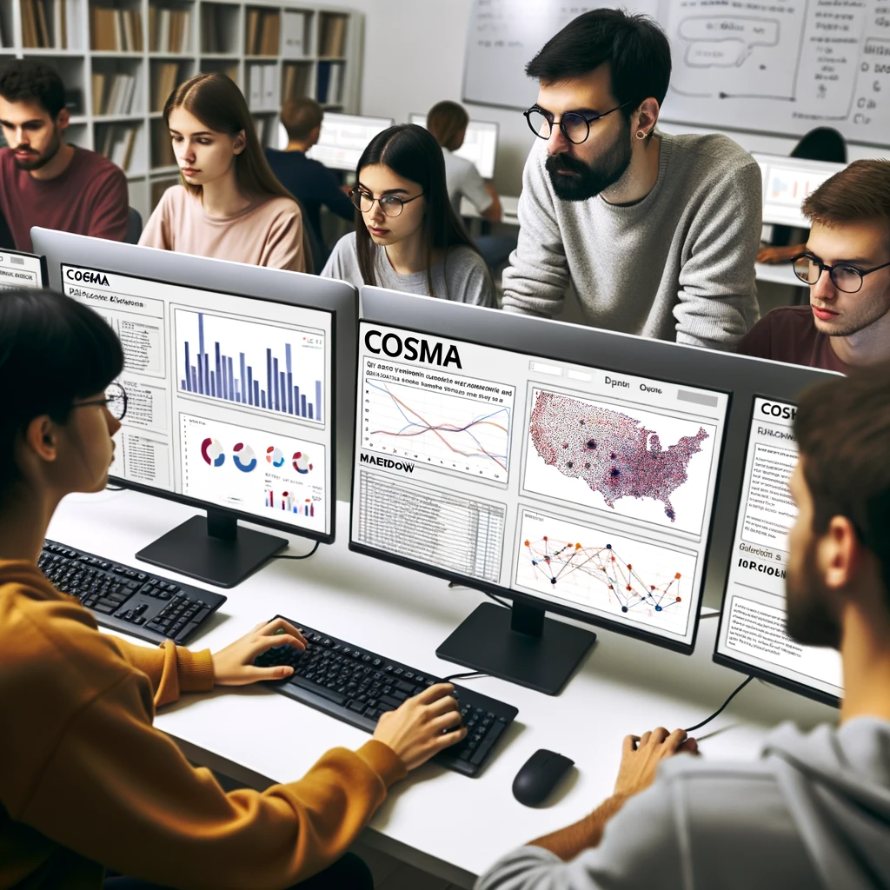
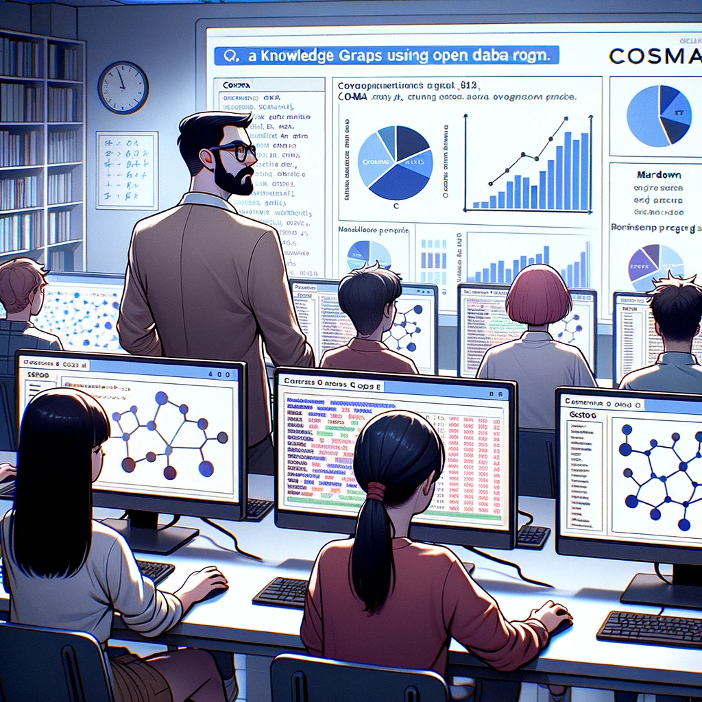

# L’open data sphère 2 : cartographie des acteurs de l’open data en France.

**Description du projet et contexte**

Le projet de l’Open Data Sphère s’inscrit dans le cadre des projets et des Saé qui se déroulent durant la troisième année de la formation du _BUT information-communication parcours information numérique dans les organisations (voir le [graphe de l’année](https://oledeuff.github.io/BUT-Infonum-3/graphe.html))_  qui est ouverte en formation initiale et continue ainsi qu'à l’alternance. 

Le projet est consultable en ligne [ici]().
Un petit [guide de navigation]() a également été produit.

Pendant les semaines où les alternants sont en entreprise, les autres étudiants sont intégrés au sein de projets ambitieux dont le but est de parvenir à livrer des réalisations de niveau professionnel à des commanditaires. Ce projet est le premier projet de l’année. Il s’est déroulé du 25 septembre au 6 octobre 2023.
Le sujet d'études était l'*open data*. L'Open Data, c'est la conviction que les données détenues par les institutions publiques devraient être mises à la disposition de tous, dans un format ouvert et accessible, pour stimuler l'innovation et favoriser la transparence. 

Les étudiants ont rassemblé des données provenant de diverses sources, environ 150 acteurs composent cette open data sphère : des  personnes, des organisations, des portails, des outils, etc. 

Le résultat prend la forme d’un graphe interactif généré grace au [logiciel COSMA](https://cosma.arthurperret.fr) qui permet d’offrir un accès facile à une vaste gamme de données. 

Sous la direction de [M. Le Deuff](https://oledeuff.github.io/BUT-Infonum-3/graphe.html#20230730225749), le but était de produire une mise à jour des données, de les transférer en format markdown, pour ensuite les mettre sur github et de les rendre disponibles et visibles sur Cosma. Le projet a nécessité l’apprentissage de formats d’écriture et de mise en forme ainsi que plusieurs logiciels. 

**Objectifs pédagogiques**

Le projet reposait  donc sur plusieurs objectifs pédagogiques qui articulaient des enjeux organisationnels, informationnels et techniques dans le but d’augmenter les capacités des étudiants à organiser et structurer l'information et de pouvoir la visualiser. Il s'agissait notamment d’apprendre :

*  Le format d'écriture simplifié Markdown
*  L'emploi d'un logiciel dédié pour la rédaction de fiches Markdown : Zettlr
*  L'utilisation d'un logiciel conçu par l'équipe de recherche E3D du Mica : Cosma
*  à documenter les actions réalisées en produisant un travail explicatif diffusé en ligne.
*  L'utilisation d'espaces collaboratifs qui permettent de partager du code comme Github.
*  L'application de principes vues en cours d'architecture de l'information
*  Mobiliser des compétences web notamment avec le CSS.
*  A utiliser Zotero de façon compatible avec un autre logiciel comme Cosma.
*  A mieux saisir l'importance des formats de données.

**Récupération des données de l’ancien projet**

Le précédent projet réalisé par les étudiants de la LP MIND sous la direction d’Arthur Perret reposait sur le logiciel de l’otletosphère.l'[otletosphère-opensphere](https://hyperotlet.huma-num.fr/opendatasphere/)

 Les données étaient quant à elles disponibles sous la forme d’un google sheet. L’enjeu initial était donc double. Il s’agissait de transférer le projet sous un nouveau logiciel : Cosma. Cosma étant à la base un projet de développement dérivé du projet de l’otletosphère, des similitudes dans la philosophie se retrouvent, notamment le principe de relier la fiche et le graphe.

Pour assurer le transfert, la première opération à consister à récupérer les données tableur pour les transformer en fiche de type markdown afin de pouvoir densifier les descriptions qui étaient succinctes dans le projet précédent du fait du choix du tableur. L’opération s’est déroulée à partir d’un export des entités sous format csv. Les métadonnées ont été mises en conformité avec les régles de Cosma pour pouvoir ensuite utiliser la fonctionnalité dédiée ‘cosma batch’ qui permet à partir d’un csv de générer autant de fiches en .md qu’il y a de lignes décrites dans le .csv.

Ce travail a été réalisé par Monsieur Le Deuff afin qu’on puisse débuter le travail rédactionnel de façon propre en repartant directement du format “fiches” plutôt que du format tableur.

Le projet avait également pour but de revoir la typologie précédente du fait de l’ajout de nouvelles fiches et de l’affichage d’une nouvelle ambition qui consistait à intégrer de nouveaux aspects notamment conceptuels et judiriques à la cartographie.

**Construction d’une nouvelle taxonomie des contenus**

*Types* 

Les noms de la catégorie “types” ont été méticuleusement choisis de sorte à pouvoir répondre à tous les acteurs sélectionnés.

La première catégorie s'intitule *personne*. Elle regroupe toutes les personnalités ayant un lien avec l’Open Data ou ayant contribué à un projet faisant avancer le domaine des données ouvertes. 

*organisation* centralise toutes les instances qui œuvrent pour des données libres : organisations publiques, organisations privées, fondations etc.

La catégorie *portail* regroupe un grand nombre de bases de données ouvertes, de différents domaines (gouvernement, éducation, transport etc.). Ces systèmes ont tous un point commun : la fonctionnalité d’émettre une recherche afin d’accéder à des données ouvertes. 

En ce qui concerne le type *outil*, sont rangés tous les systèmes qui permettent une quelconque gestion de données. 

*droit* rassemble toutes les lois, décrets, textes législatifs qui encadrent le domaine des données ouvertes en France.  

Enfin, la catégorie *notion* rassemble un grand nombre de concepts et méthodes qui visent à mieux décrire et représenter le domaine des données ouvertes. Par exemple, “notion” comprend des termes qui expliquent certains aspects des données, leurs structures, leur gestion.

Ce travail **taxonomique** s’est couplé à un début de réflexion **folksonomique** qu’il reste à perfectionner. La production de tags ouvre d’autres pistes de navigation. Mais de façon classique, la production de tags devient vite désordonnée et une première nomenclature a été proposée mais il reste encore à veiller à sa fine application dans les fiches (voir annexe 1). C’est à l’évidence un des points qu’il faudra retravailler par la suite pour ceux ou celles qui voudraient reprendre le projet.

**Design du projet**

Le logiciel Cosma permet des choix esthétiques au niveau de l’interface à la fois dans le fichier de configuration qui permet de mentionner des choix de couleur pour les types d’entités, mais aussi avec l’ajout d’un fichier css qui permet de personnaliser l’interface. Nous sommes partis d'un premier fichier .css mis en place par [M. Le Deuff](https://oledeuff.github.io/BUT-Infonum-3/graphe.html#20230730225749) pour le modifier ensuite. Nous avons également bénéficié de l'aide de [M. Borel](https://oledeuff.github.io/BUT-Infonum-3/graphe.html#20230730200845) dans cette étape. 

Ces fichiers sont disponibles également sur l’[espace github du projet](https://github.com/oledeuff/BUT-Infonum-3/tree/main/Projets/ods). Ils peuvent être repris pour proposer une nouvelle version du projet de l’Open Data Sphère mais aussi pour être réutilisés dans tout autre cadre qui mobiliserait le logiciel Cosma. Vous retrouverez dans cet espace l'ensemble des données sous forme de fiches en format markdown dans le sous-répertoire *fiches*. L'ensemble des fichiers de configuration de Cosma sont également disponibles.

*Code couleur*

Une première proposition de couleurs avait été réalisée en guide de démonstration par Monsieur Le Deuff. Cette proposition avait été générée par ChatGpt qui avait opté pour des couleurs pastels qui fonctionnaient bien ensemble. Toutefois, nous avons procédé à des rééquilibrages au niveau des couleurs et au niveau des attributions.

Nous avons donc défini les 6 couleurs en fonction des éléments suivants.

*Personne* (#FFC0CB) :

Lorsqu'il s'agit de représenter des individus, le choix des couleurs doit évoquer des traits de personnalité distinctifs. Initialement, nous avions envisagé le bleu pour sa sérénité. Cependant, le rose #FFC0CB a finalement été retenu. Cette nuance évoque non seulement la créativité, mais aussi l'optimisme, deux qualités intrinsèques à la nature humaine.

*Organisation* (#87CEFA) :

Le bleu ciel #87CEFA a été choisi pour symboliser les organisations. Cette couleur est universellement reconnue pour sa rigueur et sa fiabilité. De nombreuses marques et organisations de renom optent pour le bleu dans leur identité visuelle, comme Twitter ou HP, soulignant ainsi leur sérieux et leur professionnalisme.

*Portail* (#8FBC8F) :

Le vert #8FBC8F, souvent associé au progrès et à l'innovation, a été choisi pour représenter les portails. Cette couleur évoque également la liberté et l'accessibilité, des qualités essentielles pour des portails souvent ouverts à tous.

*Outil* (#DDA0DD) :

La technologie est fréquemment représentée par des teintes de violet. Cependant, pour garantir un impact visuel optimal, nous avons opté pour le violet #DDA0DD. Cette couleur, complémentaire du jaune, est couramment utilisée par les professionnels du design graphique.

*Droit* (#FFA07A) _:

Le saumon #FFA07A a été choisi pour symboliser le droit. Cette couleur évoque l'équilibre, la justice et la clarté, des principes fondamentaux du domaine juridique.

*Notion* (#FFD700) :

Le jaune #FFD700 a été sélectionné pour représenter les notions. Cette couleur lumineuse symbolise la clarté, la précision et la compréhension. Une notion, par essence, doit être clairement définie et facilement compréhensible.

*Liens du graphe*
L’idée de  la branche d’arbre a été évoquée, la couleur marron avait donc été sélectionnée. Mais étant souvent trop foncée, il fallait trouver une  nuance assez claire mais qui démarque bien les lignes. Les deux marrons #D9C19D et #B7966B fonctionnaient bien. Mais notre préférée était le #D9C19D

**Icônes**

Un premier choix avait été effectué à partir de fichies trouvés sur la plateforme *thenounproject.com* qui recense des fichiers avec des licences creative commons. Les fichiers initialement choisis ne permettaient malheureusement pas une utilisation étendue des fichiers car nous voulions en modifiant les couleurs pour les adapter aux couleurs choisies pour la typologie.

Au final, Monsieur Le Deuff a généré des logos en utilisant Dall-E. L’objectif a été d’essayer d’obtenir des logos symbolisant au mieux les entités décrites par la typologie.

**Licence Creative Commons.**

Nous avons choisi d’utiliser la _Licence Creative Common CC-By_  _ _pour réglementer ce projet. 

Cette dernière permet au public de partager et d’adapter notre graphe. Il est donc possible de le copier et le diffuser sur tout support ou type de format. Ce dernier peut être transformé ou complété. 

En revanche, les utilisateurs de ce graphe doivent impérativement nous créditer, intégrer un lien vers la licence CC et préciser si des modifications ont été effectuées.
Il faut donc simplement mentionner les lignes suivantes :
- Licence Creative Common CC-By [*BUT 3 Infonum 2023*](https://github.com/oledeuff/BUT-Infonum-3/tree/main/Projets/ods)

**Work in progress**

Notre travail demeure un *work in progress* dans la mesure où il n’est pas exhaustif et que d’autres choix auraient pu être effectués. 

Les nouvelles fiches ont été réalisées à partir de lectures et de découvertes issues des fiches de départ. 

Les métadonnées des fiches ont été revues et adaptées aux fonctionnalités de Cosma. Elles sont en général relativement normées à l’exception de la métadonnée :”kesako” dont le but est de donner une explication éclair sur la nature et la fonction de l’entité décrite. Trouvée après une réflexion collective par M. Le Deuff, il s’agissait finalement de répondre aussi à un besoin d’explication face au domaine de l’open data qui reste parfois difficile d’accès malgré son nom !

Certaines fiches ont été réalisées avec l’aide de chatGpt. Certaines fiches mentionnent d’ailleurs cette aide. Elles sont donc encore perfectibles à bien des égards.

Il peut donc demeurer des coquilles, des approximations voire des erreurs. Merci de nous les signaler.

Le travail a été réalisé dans un temps restreint puisque nous avions un peu moins de deux semaines pour réaliser cette cartographie.

Il est possible d’effectuer des demandes de corrections, d’ajouts ou de retraits en envoyant un mail au responsable du projet M. Le Deuff : [oledeuff@gmail.com](mailto:oledeuff@gmail.com) en mentionnant dans le titre du mail : *correction open data sphère*.

Toute demande de retrait ou de petite correction sera effectuée dans les 48H.

Pour les demandes d’ajout de fiches, il faudra patienter ou attendre une reprise du projet par de nouveaux volontaires.

Merci d'avoir pris connaissance de notre travail.

**BUT 3 INFONUM 2023**

Alicia Sargueux, Amandine Ducros Cervos, Bastien Touzé, Clément Gratia, Evan Forestier, Gaelle Dufaut Knipping, Geoffrey Sokolowski, Jean-Baptiste Laporte Fray, Louise Haigron, Lucie Peyrat, Marie Noelle Gos, Marius Peny, Morgane Delolme, Noé Mirgalet, Ruben Pujols, Simon Gueguen et Victorien Galloo.

Sous la direction d’_Olivier Le Deuff_, responsable de la troisième année du BUT Infonum.

Le projet repose sur le *logiciel Cosma*:
Arthur Perret, Guillaume Brioudes, Clément Borel, & Olivier Le Deuff. (2021). Cosma. Zenodo. [https://doi.org/10.5281/zenodo.5920615](https://doi.org/10.5281/zenodo.5920615)