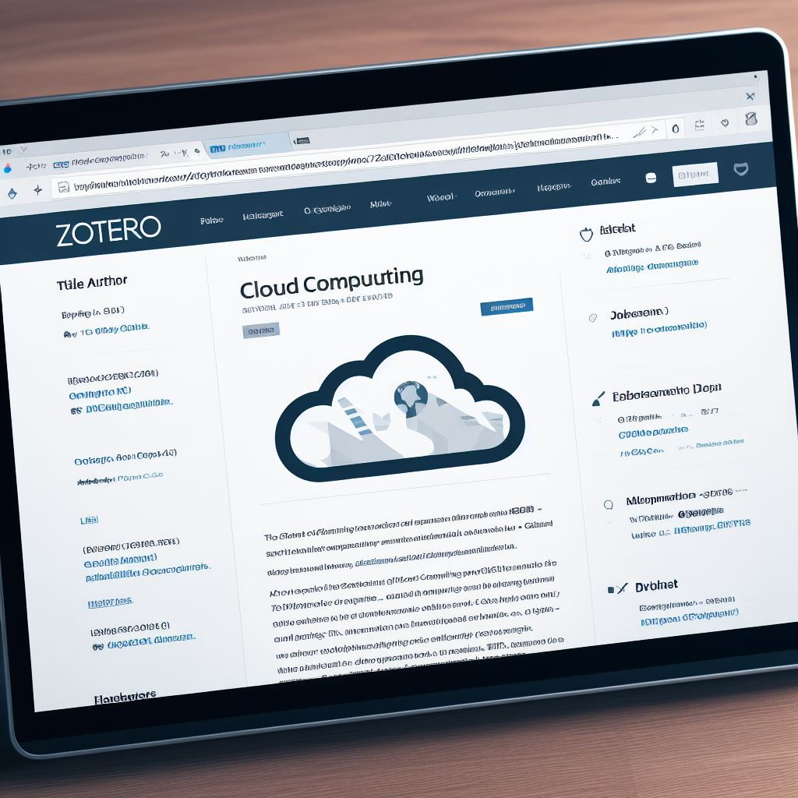

# *Projet ODS*
## **Phase 2**

---

## Objectifs du début de Semaine

- Finalisation des fiches en cours
- Réécriture "objective" des fiches
- Amélioration de la qualité du contenu
- Normalisation des entêtes.
- Articulation entre fiches.
    - toutes les fiches sont dans le *drive.*

---

## Revue des Fiches

- Évitez les descriptions promotionnelles
- Pas de copier-coller sans citation
- **Attention** : Ne basez pas vos descriptions uniquement sur ChatGPT !
- Nomination d'un.e *responsable éditorial*

---

## Entêtes YAML sur Zettlr

- Soyez rigoureux avec les métadonnées
- Remplissez-les sérieusement
- Appliquez la typologie créée par Amandine et Marie-Noelle pour la métadonnée "type"
- *Fixation* de la nomenclature à suivre (nom des métadonnées, ajout d'un lien twitter ?, etc.)
- *Nomination* d'un.e responsable de la conformité des entêtes

---

## Gestion des Tags

- Trop de tags à usage unique actuellement
- Objectif : Créer une liste de 50 tags principaux
- Ces tags doivent être significatifs et pertinents
- nomination d'un.e responsable *tags* chargé d'établir la liste des tags à privilégier.

---

## Liens entre les Fiches sur Zettlr

- Utilisez la syntaxe des double crochets `[[ ]]`
- Assurez-vous d'utiliser correctement les identifiants
- Ces liaisons permettent 
    - de créer le *graphe*.
    - de fournir *liens* et *rétroliens*.

---

## Références Zotero

- Ajoutez des références à Zotero
    - des ouvrages
    - des articles scientifiques
- Mentionnez ces références dans vos fiches Zettlr
    - nécessite un plugin betterbibtex dans Zotero
    - un export en .json à mentionner dans Zettlr
- Objectif : Générer une bibliographie complète avec Cosma

---
## Autres urgences
- Il faut essayer de prendre du temps pour lire la documentation de Cosma
- Il faut commencer à penser *design*, choix de couleurs, icônes
- il faut commencer à anticiper la *documentation* du projet
- il faut commencer à penser la *communication* du projet également
- De nouvelles responsabilités seront confiées ce soir ou demain matin.

---

## En Conclusion

- Il reste beaucoup de travail à accomplir
- Votre rigueur et votre attention aux détails sont essentielles
- Ensemble, nous pouvons atteindre nos objectifs et produire un travail de qualité
- Si la qualité des fiches est insuffisante :
    - on ne peut pas publier le graphe
    - on ne peut pas publier les documents associés
    - on ne peut pas communiquer dessus.

----
## Crédits

- *do more* Photo de <a href="https://unsplash.com/fr/@carlheyerdahl?utm_source=unsplash&utm_medium=referral&utm_content=creditCopyText">Carl Heyerdahl</a> sur <a href="https://unsplash.com/fr/photos/KE0nC8-58MQ?utm_source=unsplash&utm_medium=referral&utm_content=creditCopyText">Unsplash</a>
- *Fonds multicolor* Photo de <a href="https://unsplash.com/fr/@hameddaram?utm_source=unsplash&utm_medium=referral&utm_content=creditCopyText">Hamed Daram</a> sur <a href="https://unsplash.com/fr/photos/-5fbmfaInwg?utm_source=unsplash&utm_medium=referral&utm_content=creditCopyText">Unsplash</a>
  
- Dall-e pour les images sur l'open data.
- Licence cc by Le Deuff. 2023
