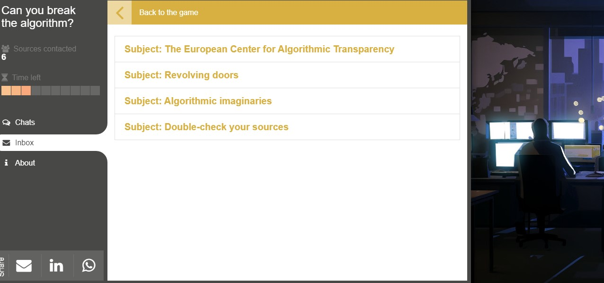

## Breaking the algorithm

**Breaking the algorithm** est un jeu sérieux réalisé par **algorithm watch**.
Il vous met en situation d'investigation journalistique sur un algorithme d'une plateforme à succès chez les jeunes publics.
Ce document précise les modalités à suivre pour en profiter pour mener une expérience qui va vous apporter des réflexes méthodologiques et des connaissances qui vous seront utiles durant le **hackathon**.
Il va donc falloir prendre des notes durant le jeu pour parvenir à rédiger un document de synthèse sur l'algorithme de *Tik Tube.* 

#### Objectif
- Comprendre l'algorithme de "TikTube" utilisé dans le jeu, identifier ses principaux critères, ses biais potentiels, et les risques psychologiques associés.
- Construire l'amorce d'un audit sur un algorithme.
- Documenter au fur et à mesurer les découvertes et informations.

#### Instructions
1. **Jouer au Jeu** :
   - Jouez au jeu "Breaking the Algorithm" plusieurs fois jusqu'à réussir.
   - Prenez des notes sur les différentes stratégies et résultats.

2. **Analyse de l'Algorithme** :
   - Identifiez les principaux critères que l'algorithme semble utiliser pour juger les contenus.
   - Hiérarchiser autant que possible ces critères.

3. **Recherche des Biais** :
   - Cherchez des indices de biais dans l'algorithme (par exemple, préférences pour certains types de contenu, discrimination, etc.).
- Décrivez les effets psychologiques potentiels de l'algorithme sur les utilisateurs (fausse perception de la réalité, tristesse etc.).
   - Mesurez la portée réélle de ces risques (avec des statistiques possiblement).

4. **Sourçage de l'Information** :
   - Pour chaque observation, indiquez le degré de certitude : 
     - **Directe** : information explicitement donnée par une personne fiable ou potentiellement fiable.
     - **Déduite** : conclusions basées sur les expériences menées avec des données **inférées**. (précisez alors le type de méthodologie employée)
   - Utilisez des sources extérieures (expertises scientifiques) si nécessaire pour expliquer les conclusions.

5. **Rédaction d'un Rapport de deux pages** :
   - Rédigez un rapport structuré incluant vos découvertes, analyses, et conclusions.
   - Assurez-vous que chaque affirmation est bien sourcée et étayée par des exemples concrets.

