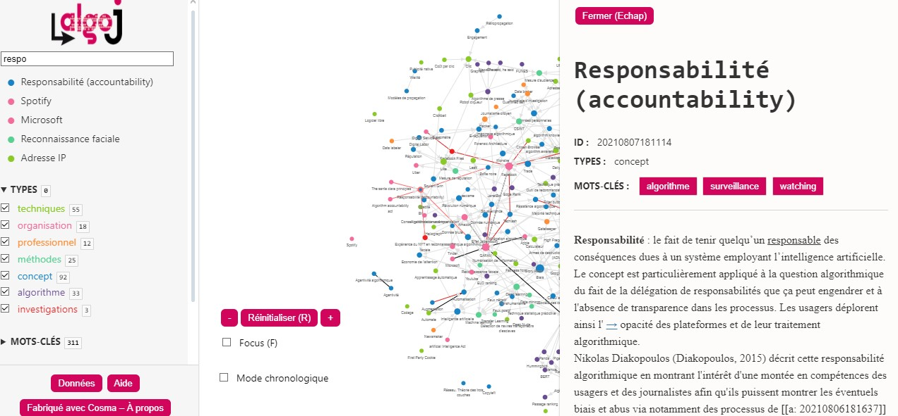

#  Vademecum du Hackathon sur les Algorithmes

## Introduction 

Bienvenue dans ce guide Vademecum destiné à l'organisation d'un hackathon axé sur les algorithmes. Inspiré par la [journée d'étude organisée par l'IJBA et le MICA](https://www.ijba.u-bordeaux-montaigne.fr/journee-detude-les-journalistes-au-defi-des-algorithmes/), qui s'est concentrée sur "Les journalistes au défi des algorithmes", ce guide vise à explorer la place croissante des algorithmes numériques dans divers domaines professionnels. En particulier, il s'attache à comprendre comment ces algorithmes façonnent notre monde, de la pratique journalistique à d'autres industries. 

## Premier Hackathon Consacré à l’Enquête Journalistique sur les Algorithmes

**Date :** 30 novembre

**Participants :** 70 étudiant.e.s en journalisme, InfoCom, et informatique de l’IJBA, de l’IUT Bordeaux Montaigne et de l’Université de Bordeaux.

**Lieu :** IJBA

**Partenaires :** Datactivist, Sud Ouest, Inria, Université de Bordeaux, CLEMI.

### Objectif

Collaboration, créativité et débrouillardise seront à l’honneur pour élaborer des stratégies d’enquêtes journalistiques sur des modèles algorithmiques utilisés par les administrations publiques ou les entreprises privées.

### Déroulement

- **Formation des Équipes :** Réparti.e.s en huit groupes, les futur.e.s journalistes, informaticien.ne.s et spécialistes de la documentation numérique.
- **Mission :** Concevoir des méthodes d’exploration d’un ensemble d’algorithmes.
- **Encadrement :** Aide d’une équipe d’encadrement multidisciplinaire.

### Contexte

A l’heure où les algorithmes envahissent tous les secteurs, il est crucial pour les professionnel.le.s de l’information, les scientifiques et les citoyen.ne.s de comprendre leur fonctionnement et leur impact.

### Cibles des Enquêtes

- Algorithmes d’aide à la décision, de détection des fraudes, d’attribution de prestations sociales.
- Algorithmes de recommandations d’achats, de classement des pages web, de distribution de l’information.
- Utilisés par la CAF, l’administration fiscale, ParcoursSup, Trouve mon Master, SNCF, Amazon, Netflix, Google, Facebook, X, ChatGPT, Midjourney, etc.

### Questions Clés

- Conformité à la loi, contrôle, production de biais, tromperie des consommateurs, propagation de fausses informations.

### Format de la Compétition

- **Matin :** Formation des équipes et choix de l’algorithme.
- **Journée :** Conception et documentation de la méthode d’enquête.
- **Présentation :** Dix minutes pour détailler l'approche.

### Jury et Récompenses

- **Présidé par :** Maelle Fouquenet de Datactivist.
- **Enjeu :** Le dossier gagnant poursuivra l’enquête avec l’aide de journalistes professionnel.le.s pour une publication dans Sud Ouest.

## Ressources Utiles

### Vidéos
- **Intervention d'Estelle Harry à Datarama**  
  [Estelle Harry à Datarama](https://www.youtube.com/watch?v=xvrr5X70puo&t=20400s)

- **Comment auditer des algorithmes d'IA, par Benoit Rottembourg**  
  [Auditer des algorithmes d'IA](https://www.youtube.com/watch?v=nlJuut_YskE)

### Articles et Publications
- **Ouvrir le code des algorithmes ne suffit plus**  
  [AOC Media - Ouvrir le code des algorithmes](https://aoc.media/opinion/2023/09/17/ouvrir-le-code-des-algorithmes-ne-suffit-plus/)

- **Rapport Bothorel**  
  [Rapport Bothorel](https://www.gouvernement.fr/upload/media/default/0001/01/2020_12_rapport_-_pour_une_politique_publique_de_la_donnee_-_23.12.2020_.pdf)

### Podcasts et Initiatives
- **Podcast du MIT "In Machine We Trust"**  
  [In Machine We Trust](https://forms.technologyreview.com/in-machines-we-trust/)

- **Algorithm Watch et le jeu Break the Algorithm**  
  [Algorithm Watch](https://algorithmwatch.org/en/) | [Break the Algorithm Game](https://algorithmwatch.org/en/break-algorithm-game/)

### Organisations et Guides
- **Travaux de Datactivist**  
  [Datactivist SPoSGL](https://datactivist.coop/SPoSGL/sections/section10.html#1)

- **Guide Etalab sur les algorithmes publics**  
  [Guide Etalab](https://etalab.github.io/algorithmes-publics/guide.html)

- **Guide de Datapublica**  
  [Guide Datapublica](https://nextcloud.datactivist.coop/s/tqos5ppqGeEArDX)
- **European Centre for Algorithmic Transparency**
[Site du projet](https://algorithmic-transparency.ec.europa.eu/index_en)
[description par Algorithm Watch](https://algorithmwatch.org/en/dsa-explained)

Le Centre européen pour la transparence algorithmique (ECAT) a été officiellement inauguré à Séville, en Espagne, le 18 avril 2023. Ce centre joue un rôle majeur dans l'examen des algorithmes des principaux services numériques tels que Facebook, Instagram et TikTok. L'ECAT est intégré au Centre commun de recherche (CCR) de l'UE, un établissement scientifique de longue date qui mène des recherches pour soutenir une large gamme de politiques de l'UE, allant du changement climatique et de la gestion des crises à la fiscalité et aux sciences de la santé. Bien que l'ECAT soit intégré au *Joint Research Centre* (JRC), il a un focus dédié sur la Digital Services Act (DSA), aidant les législateurs à rassembler des preuves pour agir contre les plateformes qui ne prennent pas leurs obligations au sérieux​​.

Les responsables de la Commission décrivent la fonction de l'ECAT comme étant d'identifier des "preuves accablantes" pour renforcer l'application de la DSA. Par exemple, un système de recommandation basé sur l'IA qui diffuse un contenu discriminatoire malgré les affirmations de la plateforme concernée qu'elle a pris des mesures pour débiaiser ses sorties. Les chercheurs de l'unité sont chargés de trouver des preuves solides pour aider la Commission à établir des cas de violation du nouveau livre de règles numériques​​.

- **le graphe AlgoJ** (lexique consultable sous forme de graphe réalisé avec le logiciel Cosma)
    [Graphe](http://www.culturedel.info/cosmoscope.html)
    

- Théories scientifiques

- **Les imaginaires algorithmiques**

## Pistes et Méthodes pour l'Organisation du Hackathon

## Mettre en œuvre la transparence algorithmique

### Contexte et Enjeux
- **Loi Pour une République Numérique** : Entrée en vigueur en 2017, mais les dispositions sur la transparence algorithmique sont peu appliquées. Les textes d'application datent de 2020 et sont peu connus. Ils sont simples dans leur intention mais complexes dans leur application. Les administrations ne savent pas toujours comment exiger des prestataires les informations nécessaires pour expliquer le fonctionnement d'un algorithme. Il y a également des enjeux de propriété intellectuelle. [Page 35](https://myaidrive.com/?r=c#/home?folder=&file=Cahier03-Transparence-algorithmique.pdf&pdfPage=35).

- **Transparence Algorithmique** : Nécessite de comprendre le contexte (à quoi sert l'algorithme), le processus administratif, le code (comment il est programmé), et les données utilisées. Sans ces éléments, l'algorithme n'est pas auditable et la redevabilité n'est pas complète. [Page 35](https://myaidrive.com/?r=c#/home?folder=&file=Cahier03-Transparence-algorithmique.pdf&pdfPage=35).

### Mise en Pratique
- **Registre des Algorithmes Publics** : Tenir et publier un registre est essentiel. Construire un registre en 5 étapes est proposé pour une mise en œuvre efficace.
- **Publication du Code et Évaluation d'Impact Algorithmique** : Ces actions sont importantes pour assurer la transparence.
- **Charte et Lignes Directrices** : Fournir des garanties humaiVoici un aperçu de certaines sources scientifiques qui traitent du concept des imaginaires algorithmiques :

1. **"Bodies not templates": Contesting dominant algorithmic imaginaries** par Becky Kazansky et Stefania Milan. Cet article, publié pour la première fois en ligne le 25 février 2021, aborde la contestation des imaginaires algorithmiques dominants. [Source](https://journals.sagepub.com/doi/10.1177/1461444820929316)

2. **Un nouvel imaginaire algorithmique** par Christian Schulz, 2023. Ce travail met en lumière le concept de "l'imaginaire algorithmique", tel que défini par Bucher en 2018, et souligne son importance dans les discours autour de la recherche sur les médias sociaux. [Source](https://journals.sagepub.com/doi/10.1177/01634437221136014)

3. **Théorisation des "Histoires sur les algorithmes" comme mécanisme dans la formation des imaginaires algorithmiques**. Cet article se penche sur les débats actuels concernant les imaginaires algorithmiques et suggère qu'il existe une lacune dans les recherches en termes de compréhension de l'organisation des imaginaires algorithmiques des utilisateurs ordinaires sur un plan social. [Source](https://journals.sagepub.com/doi/full/10.1177/20563051221077025)

4. **Subjectivité et imaginaires algorithmiques : l'autre algorithmique**. Cette recherche dans les études médiatiques critiques au cours de la dernière décennie a mis en évidence le processus de "plateformisation" de la production et de la consommation culturelle, qui est considéré comme une reconfiguration des acteurs et des structures de pouvoir de l'économie culturelle. [Source](https://link.springer.com/article/10.1057/s41286-023-00171-w)

5. **Expériences des algorithmes : comment les jeunes comprennent, ressentent et interagissent avec la curation d'actualités algorithmique sur les médias sociaux**. Cet article explore les interactions entre les algorithmes et les utilisateurs d'une perspective centrée sur l'utilisateur, examinant comment les jeunes interprètent, ressentent et s'engagent avec la curation d'actualités algorithmique sur les médias sociaux, et comment de telles expériences quotidiennes contribuent à leur littératie algorithmique. [Source](https://journals.sagepub.com/doi/pdf/10.1111/1467-9566.12900)

Ces articles fournissent un éventail de perspectives sur la façon dont les individus et la société dans son ensemble comprennent, interprètent et interagissent avec les algorithmes dans divers contextes.
nes, contractuelles et procédurales.
- **Défis et Solutions** : Aborder les obstacles communs tels que la mauvaise compréhension des enjeux ou la difficulté d'appréhender un sujet technique par les élus et agents du secteur public. Le recours aux logiciels propriétaires et aux solutions sur étagère peut également constituer une entrave. [Page 9](https://myaidrive.com/?r=c#/home?folder=&file=Cahier03-Transparence-algorithmique.pdf&pdfPage=9).

## La Transparence des Algorithmes Publics: Origines et Définitions

- **Origine du Terme "Algorithme"**: Le terme "algorithme" trouve ses origines dans l'Antiquité. Il a évolué au fil du temps, passant de simples instructions à des processus complexes utilisés dans les ordinateurs modernes.

- **Définition des Algorithmes**: Un algorithme est une suite finie et non ambiguë d’opérations ou d’instructions permettant de résoudre une classe de problèmes. Les algorithmes sont omniprésents dans la vie quotidienne et dans les administrations publiques.

- **Algorithmes dans l'Administration Publique**: Les administrations utilisent de plus en plus d'algorithmes pour des tâches variées, allant de la gestion des prestations sociales à la répartition des moyens de secours en cas d'urgence. Ces systèmes algorithmiques ont un impact significatif sur la vie des citoyens.

- **Transparence des Algorithmes**: La transparence des algorithmes est cruciale pour assurer la confiance du public. Elle implique de justifier l'utilisation de l'algorithme, d'expliquer ses effets, de rendre le code source accessible et de permettre la contestation.

- **Obligations de Transparence**: Les différentes façons de rendre des comptes correspondent à des obligations de la loi pour une République numérique ou du Règlement général sur la protection des données (RGPD).

- **Intégration des Algorithmes dans les Politiques Publiques**: Le chapitre souligne l'importance d'intégrer les algorithmes dans les politiques publiques, en tenant compte de leur impact sur les droits humains et en publiant des évaluations d'impact.

[Source: Cahier03-Tra.pdf, Pages 6, 8, 21, 24, 62, 64](https://myaidrive.com/?r=c#/home?folder=&file=Cahier03-Transparence-algorithmique.pdf&pdfPage=6)

## Intégrer les Algorithmes dans les Politiques Publiques

- **Contexte Global** : Un rapport de l'Ada Lovelace Institute, l'AI Now Institute et l'Open Government Partnership (août 2021) présente un aperçu des politiques d'encadrement des algorithmes publics, basé sur 40 politiques publiques de divers acteurs. [Page 54](https://myaidrive.com/?r=c#/home?folder=&file=Cahier03-Transparence-algorithmique.pdf&pdfPage=54)

- **Étapes Clés** : Le processus inclut la compréhension des enjeux, la formation d'une équipe multidisciplinaire, l'acculturation aux algorithmes, l'identification des algorithmes utilisés, et la publication d'un registre des algorithmes. [Page 6](https://myaidrive.com/?r=c#/home?folder=&file=Cahier03-Transparence-algorithmique.pdf&pdfPage=6)

- **Exemples Locaux** : La métropole de Nantes a adopté une charte interdisant l'utilisation de l'IA pour des décisions individuelles dans les services publics. [Page 56](https://myaidrive.com/?r=c#/home?folder=&file=Cahier03-Transparence-algorithmique.pdf&pdfPage=56)

- **Domaines d'Application** : Les algorithmes sont utilisés dans l'éducation, les prestations sociales, les interventions d'urgence, les forces de l'ordre, l'immigration, et la justice, avec une évaluation d'impact sur les droits humains. [Pages 64-65](https://myaidrive.com/?r=c#/home?folder=&file=Cahier03-Transparence-algorithmique.pdf&pdfPage=64)

- **Importance de la Transparence Algorithmique** : La transparence et l'explication des algorithmes, ainsi que la régulation politique, sont cruciales pour la confiance des citoyens. L'urgence de s'interroger sur la garantie humaine et l'indépendance des agents face aux outils algorithmiques est soulignée. [Page 67](https://myaidrive.com/?r=c#/home?folder=&file=Cahier03-Transparence-algorithmique.pdf&pdfPage=67)

# Livrables Essentiels du Hackathon

## 1. Proposition de Méthodologie et Analyse Préliminaire
- **Contenu :** Combinaison de la méthodologie d'enquête proposée et de l'analyse préliminaire de l'algorithme.
- **Objectif :** Fournir une base solide pour une enquête approfondie, incluant la collecte de données, l'analyse, et l'identification des sources.

## 2. Plan de Projet et Évaluation des Risques
- **Contenu :** Plan de projet détaillé avec une évaluation des risques et des défis.
- **Objectif :** Décrire les étapes, les ressources nécessaires, les délais, et les défis éthiques et légaux pour l'enquête post-hackathon.

## 3. Présentation Synthétique et Journal de Bord
- **Contenu :** Présentation visuelle (PowerPoint ou équivalente) et un journal de bord concis.
- **Objectif :** Résumer l'approche de l'équipe, la méthodologie, les résultats préliminaires, et documenter le processus de recherche et les leçons apprises.
