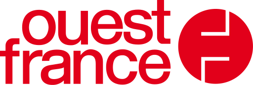

## **Séance 2: Responsabilité Sociale des Organisations (RSO)**
Le **Rapport Responsabilité Sociétale d’Entreprise** de Ouest-France.  
Un exemple de *communication responsable.*

---

## **Ouest-France : Présentation**

- **Fondateur**: Paul Hutin-Desgrées
- **Année de création**: 1944
- **Premier quotidien en France**:  
  > "Ouest-France s’est développé pour devenir rapidement le premier quotidien en France, diffusé dans douze départements du Grand Ouest."  
  (Page 19)  
  > Ouest-France est le premier quotidien français payant et premier quotidien francophone au monde.

---

## **Mission et Éthique d'Ouest-France**

- **Devise**:  
  > "Justice et Liberté."  
  (Page 92)

- **Mission**:  
  > "Éclairer, informer, relier les citoyens pour faire progresser le bien commun, dans le respect de la dignité de chacun."  
 
---

## Un rapport annuel

- des *nouveautés* chaque année
- dans les informations
- dans les réalisations
- une nouvelle infographie résumé (p.40)
- avec un gros défi pour les prochains rapports 

---

## **Charte de l'éthique**

> "Dire sans nuire, Montrer sans choquer, Témoigner sans agresser, Dénoncer sans condamner."  

Le socle de cette éthique repose sur le respect absolu de la personne humaine.

---

## **Positionnement éthique humaniste**

Ouest-France, fidèle à son héritage humaniste, place la personne humaine au centre de son approche éditoriale et de sa responsabilité sociétale.  

---

## **L'importance de l'information dans le contexte actuel**

- **Exigence éditoriale**:  
  > "Le devoir d'information, l'exigence éditoriale et la qualité de l'information."  
  

---

## **Évolution numérique**

- **accessibilité diverse**:  
  > la priorité opérationnelle du nouveau directoire est le développement de la diffusion papier et numérique. Cela dans la perspective d’atteindre tous les citoyens, quels que soient leur âge, leur budget et leurs usages, en conformité avec le positionnement populaire que revendique Ouest-France.
  **Chiffre clé**:  
  648 millions de pages vues par mois en 2023.

---
### **Éthique de l'information**

- 
  > Dans sa mission d’information, Ouest-France veut être
un repère pour les lecteurs, afin :
 D’aider à comprendre les événements et les évolutions
économiques et sociales.
 De relier les personnes et les communautés, en informant
“de la commune au monde”.
 D’aller à la rencontre des communautés qui peuplent les
territoires, ce qui reste essentiel pour la vie de la démocratie. Et ce, en multipliant les contrôles de qualité et de véracité de l’information. L’éthique de l’information fonde le **contrat de confiance** qui lie chaque jour le journal et le site internet avec ses lecteurs et internautes.  
  
---
## anticipation et innovation
- OF veut éviter de s'adapter et préfère anticiper.
- Ateliers d'innovation
- Logique d'innovation ascendante
- Faciliation des remontées d'idées

---

## **Approche numérique et enjeux écologiques**

- **Numérique responsable**:  
  > "Déroulement du plan d’actions numérique responsable (mise en place d’un outil de mesure des pages du site, achat de matériel reconditionné, optimisation des serveurs)."  
    **Action clé**:  
  Transition vers une distribution en véhicules électriques.

---

## **Bilan Carbone® 2023**

- **Empreinte environnementale**:  
  > En 2023, le bilan carbone® de Ouest-France s’élève à 44,110 tCO2e.  
  Ouest-France a réduit son intensité carbone de 6,4% en 2023 par rapport à 2022.

- **Empreinte carbone par exemplaire**:  
  Chaque exemplaire de *Ouest-France* produit émet environ **205 grammes de CO2 équivalent (gCO2e)**.

---

## **Conclusion**

- **L'avenir de l'information à l'ère numérique et les responsabilités environnementales**  
  Ouest-France continue de réduire son empreinte carbone tout en s'engageant sur la qualité de l’information et la participation citoyenne.

- **Besoin d'un audit des pratiques** (extérieur).
