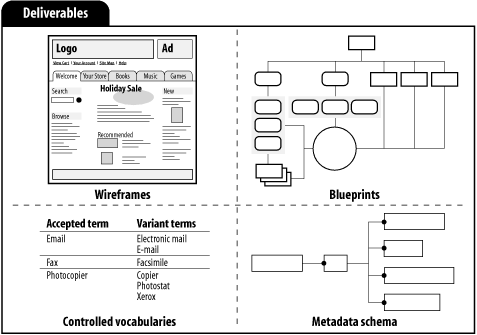

   
# Architecture de l’information. Partie 1. Introduction.

*BUT 3 Infonum* Olivier Le Deuff. oledeuff@gmail.com

---
## Une vision critique ?
> "On ne peut pas être architecte (que ce soit de l’architecture réseau, applicative ou même de l’architecture des données) en étant incapable de porter un regard critique" - C. Fauré.

---

## Un cours encore innovant?
- La thématique est désormais déjà ancienne.
- Plusieurs approches se mêlent ou s’opposent
- Les principes du cours seront réinvestis dans des *réalisations* et des *projets*
- Prolongement du cours avec une approche appliquée au niveau des data papers.

---

## Plan du cours
1. Séance 1: Introduction au concept.
2. Séance 2. Organologie d’un site ou dispositif type web.
3. Séance 3. UX. Les enjeux de l'expérience utilisateur.
4. Gestion d'un projet en AI
5. La relation au design d'information
6. Classer et organiser
7. Trans et transmédia.

---

## Evaluation
- Réalisation d'un minisite (voir cahier des charges)
- Réalisation d'un data paper
---

## Un contexte multidisciplinaire
- Plusieurs disciplines mobilisées dont des disciplines récentes : design…
- Et des disciplines plus anciennes comme l’organisation des connaissances

---

## Un contexte professionnel lié au web
- Des prémisses dans les premiers environnements informatiques
- L’influence de l’IHM
- L’ombre de Douglas Englebart ?
- Une vision professionnelle et commerciale du web

---

## Englebart

---

## Qu’est-ce que l’architecture de l’information ?
- Une nouvelle (?) profession
- Brève histoire
- Positionnements & définitions
- Associations professionnelles
- Ressources
- Enjeux

---

## Une nouvelle profession
### Brève histoire
- Au tout début Xerox Parc (Palo Alto Research Center, 1970)…

---

## Richard Saul Wurman (1976)
> "... Thought 'architecture' was a better way of describing what I thought was the direction that more people should look into for information, and I thought the explosion of data needed an architecture, needed a series of systems, needed systemic design, a series of performance criteria to measure it."

---

## Wurman comme inventeur du concept
- Communication en 1976 à un congrès d’architecture
- Article en 1975 "Beyond Graphics: The Architecture of Information,” which was published by the AIA Journal in 1975
- Hésitation entre design et architecture.

---

## Vidéo de Richard Saul Wurman

---

## Une petite histoire

voir ce [billet sur Medium](https://medium.com/@jessica.k.roschen/a-history-of-ia-where-it-all-began-d23730691dd5)

----
## Le renouveau
- Peter Morville et Louis Rosenfeld (1998), The Polar Bear

- Bible du domaine avec un ancrage traditionnel dans l'histoire du livre et le monde des bibliothèques
- et le passage au numérique et notamment aux *sites web*

---

## Une nouvelle profession ?

---

## Une nouvelle profession
### Définitions
Plusieurs définitions ont été émises qu'il faut désormais revoir quelque peu en incluant de plus en plus la question des données

---
 # Définition 1
 
 > L’architecte d’information intervient en amont d’un projet de conception de site web, d’intranet ou de logiciel de grande envergure. Il définit la typologie et la classification des contenus, optimise la navigation et la recherche d’information en fonction des objectifs et du public visé et modélise l’ensemble dans des maquettes fonctionnelles (wireframe). Il garantit « l’utilisabilité » du produit et la « trouvabilité » [détection] des informations et enrichit « l’expérience utilisateur ». L’architecte d’information exerce essentiellement en agence Web. (Portail des métiers de l’Internet)

 
 ---
 # Définition 2
 
 > Intervenant lors des différentes phases de conduite d'un projet de site web, d'intranet ou de logiciel de grande envergure, il a pour rôle principal de proposer, et spécifier une organisation efficiente de l'information au sein du dispositif cible. Il intervient également pour vérifier l'adéquation du dispositif mis en œuvre aux besoins spécifiés et son bon fonctionnement. Véritable chef d'orchestre il est en relation avec différent métiers, définit la typologie et la classification des contenus, optimise la navigation et la recherche d'information en fonction des objectifs et du public visé. (ADBS)
---
#  Définition 3 et 4
> Responsable de la structure et de la terminologie du contenu d’un site web ou d’une application, l’architecte de l’information oriente l’expérience utilisateur. (Les métiers du design interactif)
> L'architecture de l'information est la structure d'organisation sous-jacente à un système de contenu. Ce système de contenu peut être le web, et c'est souvent dans ce cadre que l'on parle d'architecture de l'information. (Ergolab)

---

## Une nouvelle profession
### Définition
Selon **l’Information Architecture Institute** :
- La conception structurelle des espaces d’information partagée;
- L’art et la science d’organiser et de cataloguer des sites Web, des intranets, des communautés virtuelles et des logiciels pour en faciliter l’utilisation et le repérage; 
- Une communauté de pratique émergente fondée sur l’apport de principes du design et d’architecture spécifiques à un environnement numérique. 

---

## Une nouvelle profession
### Définition
Selon **Morville et Rosenfeld** :
- The structural design of shared information environments.
- The combination of organization, labeling, search, and navigation systems within web sites and intranets.
- The art and science of shaping information products and experiences...
- An emerging discipline and community of practice...

---

## Une nouvelle profession
### Positionnement
**Et aussi** :
> L’architecte de l’information doit faciliter un accès compréhensible, cohérent et fluide aux contenus et à leur remodelage collaboratif, alors que ceux-ci sont désormais disponibles via des canaux multiples (tablettes, mobiles) pour des utilisateurs identifiés, localisés et qui y accèdent en temps réel, par bribes et par à coups, à n’importe quel moment et de n’importe quel endroit. (Habert, Salaün, Magué, 2011)

---

## Une nouvelle profession
### Enjeux économiques
(d’après Morville & Rosenfeld)
- Une bonne architecture de l’information permet de réaliser des économies sur :
  - La recherche d’informations
  - Le silence en information

---

## Une nouvelle profession
### Enjeux académiques
- Participer à la reconnaissance de la profession en francophonie.
- Faire émerger une recherche en architecture de l’information.
- Actuellement confondu pour une grande partie avec la recherche en *design* d'un côté et les *systèmes d'information* de l'autre avec des emphases sur *information retrieval* et les méthodes de *ranking*

---

## Qu’est-ce que l’architecture de l’information ?
- Une nouvelle (?) profession
- En pratique
- Quelques notions
- Une démarche
- Des livrables
- Des systèmes informationnels

---

## En pratique
### Quelques notions
(d’après Morville & Rosenfeld)
**La triple approche**

---

## En pratique
### Une démarche (1)

---

## En pratique
### Une démarche (2)
Matthieu Mingasson, [Conférence à ParisWeb](http://graphism.fr/mthodologie-du-design-dexprience-rcapitule-comprend-tout)

---

## En pratique
### Des livrables
(d’après Morville & Rosenfeld)

---
## En pratique
### Des systèmes informationnels
(d’après Morville & Rosenfeld)
- Systèmes d’organisation
- Modélisation du domaine
- Systèmes de navigation
- Menus de destinations populaires (aller vite à…)
- Systèmes de recherche
- Moteurs
- Systèmes par catégories

---

## Une approche systémique

---

## A lire
- JMS, B. Habert
- [Lien vers l'article](https://halshs.archives-ouvertes.fr/halshs-00801779/document)
- Le [chapitre 1 de Morville & Rosenfeld] (https://www.oreilly.com/library/view/information-architecture-for/0596527349/ch01.html) (en anglais)

---
## *Credits*
- Certaines slides sont inspirées du cours introductif de JM. Salaün à l'époque du Master en architecture de l'information de l'ENS de Lyon.
- Les images systems, deliverables and concepts sont issus de l'ouvrage de Morville & Rosenfeld.
- Les autres images sont générées par Dall-E notamment le petit ours.
    