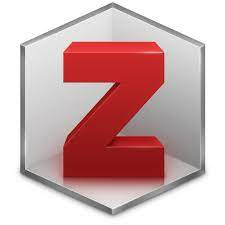

# Introduction au Data Paper
BUT INFONUM 2023
Olivier Le Deuff
CC by


---

## Qu'est-ce qu'un Data Paper?

>Un **data paper** est un document qui décrit un ensemble de données, fournissant des détails sur sa collecte, son traitement, son contenu, son potentiel d'utilisation, et d'autres informations pertinentes. Il est conçu pour partager des *données de recherche* avec la communauté scientifique.

---

## Pourquoi le Data Paper est-il important?

- Favorise la **transparence** en recherche
- Encourage le **partage de données**
- Augmente la **visibilité** des données de recherche
- Permet une **reconnaissance académique** pour la collecte et le traitement des données

---

## Définition du data paper
- Projet DoRANum : data papers comme articles scientifiques à part entière. (Doranum 2017)
- But : Rendre les jeux de données *accessibles*, *interprétables* et *réutilisables*.
    - [logique *FAIR*](https://en.wikipedia.org/wiki/FAIR_data)
- Pas un espace de débat scientifique ou de présentation détaillée de résultats.
- Focus sur les "quoi, où, pourquoi, comment et qui des données".

---
## Raw data is oxymoron (Gitelman, 2013)
- La date n'existe pas en soi
- Il s'agit d'une construction
    - qu'il s'agit d'expliquer
    - de pouvoir comprendre et vérifier
    - de pouvoir reprendre en tout ou partie
---
## Vision des SHS vs STM
- STM (*Sciences, Technique & Médecine*) : data paper comme article descriptif court (max 10 pages).
- SHS : écrit d'accompagnement respectant la tradition littéraire.
- Accompagnement des producteurs de données pour comprendre, évaluer et réutiliser le jeu de données.
(voir Kembellec, Le Deuff, 2022)

---

## Évaluation des données
- STM : Qualité induite par la qualité des données initiales.
- SHS : Données comme productions d'observations ou d'analyses subjectivées.
- Distinction entre *data* et *capta* ou data et *sublata*.
- Nécessité d'une contextualisation plus expressive en SHS.

---

## Tradition littéraire des SHS
- Productions plus prolixes en SHS.
- Data paper en SHS : construction écrite dans les canons de la discipline.
- Description des méthodes, droits de réutilisation, forces et limites des jeux de données.
- Valorisation du "travail invisible des données" par les ingénieurs et documentalistes.
---

## Contexte et Méthodologie
- Contexte de production d’un jeu de données de recherche.
- Cadre de production : projets de recherche, projets professionnels, méthodes propres.
- Explication des méthodes de collecte et de sélection.
- Sources, choix de sélection, techniques numériques, algorithmes, logiciels.
- Description méthodologique et/ou adjonction d’un notebook.
- Moyen de citer et d’accéder physiquement aux données.

---

## Métadonnées et Principes FAIR
- Métadonnées : documenter et permettre la réutilisation des données.
- Principes du FAIR : données accessibles, sous licence ouverte, formats ouverts.
- Métadonnées explicites, en lien avec le Web sémantique.

---

## Plan d'un data paper (selon Gay,2021)
1. **Contexte et résumé** : Description de données, contexte scientifique, utilisations potentielles.
2. **Méthodes** : Processus de production des données pour reproductibilité.
3. **Fichiers de données** : Description de chaque jeu de données.
4. **Validité des données** : Analyses pour confirmer la validité.
5. **Notes d’usage** : Procédures de réutilisation.
6. **Disponibilité du code** : Reproductibilité, accès au code.

---

## Le contenu d'un data paper selon DoRANum

<iframe src="https://doranum.fr/data-paper-data-journal/contenu-data-paper_10_13143_8r3d-k505/" width="100%" height="500px"></iframe>

---

## Documenter aussi le code
- Cela signifie mentionner des scripts utilisés
- Idéalement avec la possibilité de les copier. Un exemple ci-dessous en   
[Python](https://www.python.org/)
```python
import pandas as pd

data = pd.read_csv('data_paper_example.csv')
print(data.head())
```

---


## Data Paper à la RSFSIC

La rubrique **data paper** de la RSFSIC (Revue de la société française des sciences de l'information et de la communication) est dédiée à la publication de data papers de haute qualité, contribuant ainsi à la diffusion et à la reconnaissance des efforts de collecte de données.

---
## Open Data et Data Paper

L'**Open Data** fait référence à des données qui sont librement accessibles et utilisables par quiconque. Les data papers jouent un rôle crucial dans l'écosystème de l'Open Data en fournissant une *documentation détaillée* sur les ensembles de données ouverts.

---
## Extension du domaine du data paper
- Les principes scientifiques s'étendent à d'autres domaines
    - Les territoires de l'Open Data
    - Les applications éducatives
    - Le journalisme et le data journalisme
    - les entreprises privées, les ONG ou les administrations en quête de *transparence* et de *responsabilité*

---
# Outils pour réaliser un Data Paper
)

---

## Rédaction en Markdown
- **Logiciels dédiés** : Utilisez des éditeurs comme **Zettlr**  pour une rédaction fluide. Vous pouvez utiliser aussi des éditeurs de code comme ( 
[Visual Studio](https://visualstudio.microsoft.com/)
- **Format universel** : Le  ) [Markdown](https://daringfireball.net/projects/markdown/) est largement accepté et peut être converti en de nombreux autres formats.

---

## Carnet Jupyter
- **Analyse interactive** : Exécutez et modifiez le code en temps réel.
- **Documentation intégrée** : Combinez code, résultats et explications dans un seul document.
- Vous pouvez également utiliser l'outil [*Colab*](https://colab.google) de Google ou l'outil [*noteable.io*](https://noteable.io) qui peut s'utiliser aussi avec ChatGpt
 
[CoLab (Google Colaboratory)](https://colab.research.google.com/) 
 
[Noteable](https://noteable.io/)

---
## Tenir à jour et organiser sa bibliographie
- Utilisez   qui nous servira dans de nombreux cas.
- Pensez à la possibilité de créer des groupes.
- Intégration clef en main dans **Zettlr** avec le plugin **betterbitex**

---
## Intégration des données sur Zenodo
- **Archivage pérenne** : Assurez-vous que vos données sont stockées en toute sécurité.
- **DOI pour vos données** : Chaque ensemble de données reçoit un identifiant numérique unique pour une citation facile. 

---
## Conclusion

Le data paper est un outil essentiel pour la communauté scientifique, favorisant la transparence, le partage et la reconnaissance des efforts de collecte de données. Il joue un rôle crucial dans la promotion de l'Open Data et la diffusion des connaissances.
Son extension à d'autres domaines va permettre d'envisager des formes un peu différentes mais qui reposent sur des principes de base en commun.

---
## Crédits et bibliographie
    Slides : Marp avec VsStudio.
### Références

<small>

- **Doranum.** (s. d.). Le contenu d’un data paper – DoRANum. [Lien](https://doranum.fr/data-paper-data-journal/contenu-data-paper_10_13143_8r3d-k505/)
  
- **Gay, V.** (2021, novembre). Un data paper en SHS : Pourquoi, pour qui, comment ? #dhnord2021 - Publier, partager, réutiliser les données de la recherche : les data papers et leurs enjeux. [Lien](https://hal.science/hal-03434216)
  
- **Gitelman, L.** (2013). Raw Data Is an Oxymoron. The MIT Press. [DOI](https://doi.org/10.7551/mitpress/9302.001.0001)
  
- **Kembellec, G., & Le Deuff, O.** (2022). Poétique et ingénierie des data papers. Revue française des sciences de l’information et de la communication, 24, Article 24. [DOI](https://doi.org/10.4000/rfsic.12938)

</small>


