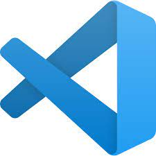
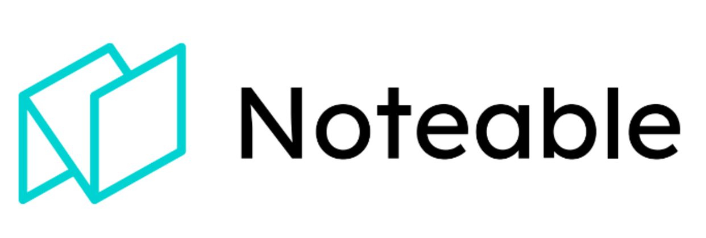
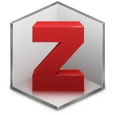

# Introduction au Data Paper
BUT INFONUM 2025  
Olivier Le Deuff — CC BY


---

## Qu'est-ce qu'un Data Paper ?

> Un **data paper** est un document qui décrit un ensemble de données : collecte, traitement, contenu, structure, conditions de réutilisation, potentiel d’usage, et éléments de qualité. Son objectif est de **partager** et **rendre citables** des *données de recherche*.

---

## Pourquoi le Data Paper est-il important ?

- Favorise la **transparence** et la **reproductibilité**
- Encourage le **partage** et la **réutilisation**
- Augmente la **visibilité** (citations, impact)
- Donne une **reconnaissance académique** au travail de collecte, curatelle et documentation

---

## Définition du data paper

- Projet **DoRANum** : le data paper est un **article scientifique** à part entière (2017).
- But : rendre les jeux de données *accessibles*, *interprétables* et *réutilisables* (**FAIR**).
- Ce n’est **pas** un lieu de débat scientifique sur les résultats.
- Focus sur les **quoi, où, pourquoi, comment et qui** des données.

> Logique **FAIR** : [Findable, Accessible, Interoperable, Reusable](https://en.wikipedia.org/wiki/FAIR_data)

---

## « Raw data is an oxymoron » (Gitelman, 2013)

- La **donnée** n’existe pas “en soi”
- C’est une **construction** :
  - expliciter l’**origine** et la **méthode**,
  - permettre la **compréhension** et la **vérification**,
  - faciliter la **réutilisation** (tout ou partie).

---

## Vision des SHS vs STM

- **STM** (*Sciences, Technique & Médecine*) : data paper souvent bref et descriptif (≤ ~10 pages).
- **SHS** : écrit d’accompagnement plus narratif, contextualisation plus **expressive**.
- Objectif commun : **accompagner la réutilisation** (compréhension, évaluation, limites).  
*(Kembellec & Le Deuff, 2022)*

---

## Évaluation des données

- **STM** : Qualité corrélée à la qualité instrumentale/expérimentale.
- **SHS** : Données comme **productions d’observations**/d’interprétations situées.
- Distinction **data / capta** (ce qui est “pris”/construit) et **data / sublata**.
- Nécessité d’une **contextualisation** riche (protocoles, biais, limites).

---

## Tradition littéraire des SHS

- Écrits plus **prolixes** et **contextualisés**.
- Data paper en SHS : **construction** dans les canons de la discipline.
- Décrire méthodes, **droits de réutilisation**, **forces/limites**, périmètre.
- Valoriser le **travail invisible** (ingénieurs, documentalistes, data stewards).

---

## Contexte et Méthodologie

- **Contexte** : projet, terrain, période, équipe, contraintes.
- **Méthodes** : collecte/sélection (protocoles, instruments, critères).
- **Techniques numériques** : algorithmes, logiciels, versions.
- **Notebook** / annexe méthodologique si pertinent.
- **Accès** (URL, dépôt, licences) et **citation** des données.

---

## Métadonnées et Principes FAIR

- **Métadonnées** : décrire pour **retrouver**, **comprendre**, **réutiliser**.
- **FAIR** :
  - *Findable* : DOI, identifiants persistants, indexation.
  - *Accessible* : modalités d’accès (authentification/embargo/API).
  - *Interoperable* : formats ouverts, vocabulaires, schémas.
  - *Reusable* : licences claires, provenance, qualité.
- Lien avec **Web sémantique** (ontologies, vocabulaires contrôlés).

---

## Plan d'un data paper (selon Gay, 2021)

1. **Contexte & résumé** : données, contexte scientifique, usages potentiels.  
2. **Méthodes** : processus pour la **reproductibilité**.  
3. **Fichiers de données** : description structurée (format, variables, taille).  
4. **Validité des données** : contrôles/analyses de qualité.  
5. **Notes d’usage** : prérequis, scénarios de réutilisation, limites.  
6. **Disponibilité du code** : dépôt, version, exécution.

---

## Le contenu d'un data paper selon DoRANum

- Consulter : https://doranum.fr/data-paper-data-journal/contenu-data-paper_10_13143_8r3d-k505/
- Si l’affichage embarqué n’est pas possible (PDF), **donner le lien** en ressources.

---

## Documenter aussi le code

- Mentionner les **scripts** (langage, version, libs).
- Fournir un **lien vers le dépôt** et un **README**.
- Exemple (Python) :

```python
import pandas as pd

data = pd.read_csv('data_paper_example.csv')
print(data.head())
```

---

## Data Paper à la RSFSIC

La rubrique **data paper** de la *Revue de la société française des sciences de l'information et de la communication (RSFSIC)* contribue à la diffusion et la reconnaissance des efforts de **collecte** et de **documentation** des données.

---

## Open Data et Data Paper

- **Open Data** : données librement accessibles et réutilisables.
- Rôle du **data paper** : **documentation détaillée** et citabilité.
- Bénéfices : **interopérabilité**, **transparence**, **impact sociétal**.

---

## Licences & aspects juridiques / éthiques

- **Licences** : CC0 / CC BY / ODbL… (adapter au type de données).
- **RGPD & données personnelles** : anonymisation, minimisation, consentement, DPD.
- **Données sensibles / Éthique** : protocoles, comités, restrictions de partage.
- **Droits tiers** : droits d’auteur, bases de données, marques.

---

## Checklists pratiques

- ✅ DOI, dépôt pérenne, versionnage  
- ✅ Métadonnées complètes (schéma choisi explicitement)  
- ✅ README d’ensemble + README par fichier si besoin  
- ✅ Licences données & code, conditions d’accès  
- ✅ Tests de réutilisation (scripts d’exemple, notebook)  
- ✅ Contacts (auteur·ices, affiliation, ORCID)

---

## Outils pour réaliser un Data Paper


Éditeurs, gestion bibliographique, environnement de code, dépôts…

---

## Rédaction en Markdown

- **Éditeur** : **Zettlr** pour la rédaction fluide.  
  
- **Éditeur de code** : **Visual Studio Code** (extensions Markdown).  
  
- **Format universel** : le [**Markdown**](https://daringfireball.net/projects/markdown/) se convertit en de multiples formats.

---

## Carnet Jupyter

- **Analyse interactive** : code + résultats + texte.
- **Documentation intégrée** : notebooks reproductibles.
- **Alternatives** :
  - [**Colab** (Google Colaboratory)](https://colab.research.google.com/)
  - [**Noteable**](https://noteable.io)

 

---

## Tenir à jour et organiser sa bibliographie

- **Zotero** (groupes, partages, export).  
- Intégration **Zettlr ↔ Zotero** via **Better BibTeX** (styles CSL, citations).



---

## Intégration des données sur Zenodo

- **Archivage pérenne** & **DOI** par version.
- Déposer : données, métadonnées, **licence**, **README**, **code** si possible.


---

## Où publier un data paper ?

- **Data journals** dédiés (disciplinaires ou généralistes).
- **Rubriques “data”** de revues existantes (ex. RSFSIC).
- Lien avec le **dépôt** (Zenodo, HAL, entrepôts disciplinaires).
- Vérifier : **portée**, **politique de licence**, **exigences de métadonnées**.

---

## Conclusion

Le **data paper** : un levier pour la **transparence**, la **réutilisation** et la **reconnaissance** du travail de données.  
Son extension à d’autres domaines (éducation, data journalisme, administrations, ONG) repose sur des **principes communs** : documentation, traçabilité, ouverture raisonnée.

---

## Crédits et bibliographie

- **DoRANum.** *Le contenu d’un data paper*.  
  https://doranum.fr/data-paper-data-journal/contenu-data-paper_10_13143_8r3d-k505/
- **Gay, V.** (2021). *Un data paper en SHS : Pourquoi, pour qui, comment ?*  
  https://hal.science/hal-03434216
- **Gitelman, L.** (2013). *Raw Data Is an Oxymoron*. MIT Press.  
  https://doi.org/10.7551/mitpress/9302.001.0001
- **Kembellec, G., & Le Deuff, O.** (2022). *Poétique et ingénierie des data papers*. RFSIC, 24.  
  https://doi.org/10.4000/rfsic.12938
