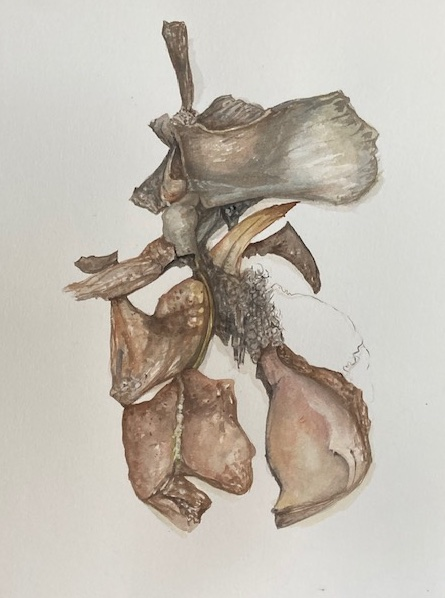
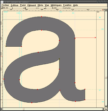

# Johanna Drucker
## Une chercheuse à l'interface des humanités digitales
Olivier Le Deuff

---

# Johanna Drucker

- Née le 30 mai 1952 à Philadelphie
- Études en arts avant un doctorat à Berkeley en 1986
- Professeure dans plusieurs universités américaines
- Membre de l'American Academy of Arts and Sciences

---

## Entre art et lettres
- Parcours académique mêlant théorie et expérimentation
- Travail initial entre l'art et les lettres
- Étude de la visualisation de l'information
- Le texte comme média visuel
- Influence sur les professionnels de l'information et la documentation,les disciplines artistiques, esthétique et design

---

## Livres d'artistes et œuvres mixtes
- Mise en avant des livres d'artistes
- Production artistique 
- Étude de la typographie dans une approche matérialiste
- Pratique d'art moderne floutant les lignes entre art et littérature

[site perso](http://www.johannadrucker.net/artworks.html)

---

## Speclab
- Projet d'informatique spéculative
- Esthétique numérique pour les sciences humaines et sociales
- Produire des logiques propres aux projets en dehors des logiques classiques des outils numériques.

---

## Figure des humanités digitales
- Positionnement au carrefour des disciplines
- Dépassement des cadres imposés par l'informatique
- Approche esthétique, expérimentale, et critique
- Co-design et design de participation

---

# Le glyphe selon Drucker
- Analyse à partir du glyphe
- Intérêt pour le glyphe et son potentiel symbolique et ésotérique
>Un glyphe (du grec : γλυφή / gluphḗ, « ciselure », « gravure ») est une représentation graphique d'un signe typographique. [wikipédia](https://fr.wikipedia.org/wiki/Glyphe)

---

# La démonstration du construit des données

## Données comme construction
- Distinction entre données et "vérité miracle"
- Les données sont des capta, des éléments de captation
- Nécessité de distinguer les processus d'acquisition et de visualisation
- Importance de l'interprétation des données

---
## Visibilité et invisibilisation du processus
"Le rendu de l'information statistique sous forme graphique lui confère une simplicité et une lisibilité qui cachent tous les aspects du cadre interprétatif original sur lequel les données statistiques ont été construites." - Drucker, 2011a

---

## IHM et importance de l'humain
- Critique des environnements informatiques centrés sur le système plutôt que sur l'utilisateur
- Nécessité de revenir à une approche utilisateur centrée

---

## Citation sur l'IHM
"L'interface n'est pas une chose, mais une zone d'*affordances* organisée pour soutenir et provoquer des activités et des comportements de manière probabiliste." - Drucker, 2011b

---

## L'interface 
>« Qu'est-ce qu'une interface ? Si nous pensons à l'interface comme une chose, une entité, une structure fixe ou déterminée qui supporte certaines activités, elle tend à se recréer de la même manière qu'un livre le fait dans la description traditionnelle. Mais nous savons qu'un livre type codex n'est pas une chose, mais un ensemble structuré de codes qui soutiennent ou provoquent une interprétation qui est elle-même performative. La théorie de l'interface doit prendre en compte l'utilisateur / spectateur, en tant que sujet situé et incarné, et les affordances d'un environnement graphique qui médiatise les activités intellectuelles et cognitives. » (Drucker, 2011b)

----
## Influence des codes graphiques

>L'interface est ce que nous lisons et la façon dont nous lisons combiné par engagement. L'interface est une provocation à l'expérience cognitive. Si nous séparons généralement ce que nous considérons comme « contenu » à partir des wireframes [3] et des techniques d'affichage, nous effectuons des actes aveugles. Nous ne lisons pas de contenu indépendant de l'interface sur un écran plus que nous ne le faisons lorsque nous lisons le journal. Nous ne devons que supprimer les codes graphiques d'un texte imprimé – mettre ses lettres et mots dans une séquence simple, enlever le paragraphe, les hiérarchies, l'espacement des mots, etc. – pour voir combien nous dépendons de ces éléments de format comme partie intégrante de la production de la signification.  (Drucker, 2011b)
---

# Dispositifs graphiques : Narration et Navigation
### Par Johanna Drucker
#### Publié dans Narrative, Mai 2008

---

## Résumé du texte
Les dispositifs graphiques dans les textes narratifs, tels que les en-têtes, les numéros de page, les espacements et les marges, contribuent à la structure narrative et à l'expérience de lecture.

---

## Importance du paratexte et des élements graphiques.
"Ces éléments sont souvent négligés en raison de leur familiarité, mais ils jouent un rôle significatif dans la compréhension et l'interprétation du texte par le lecteur."

---

## Contexte Historique et Culturel
"Apprendre à lire ces éléments graphiques peut révéler des suppositions sous-jacentes et des valeurs idéologiques au sein d'un texte."

---

## Exemples
"Des exemples tirés de journaux du 19e siècle montrent comment le placement des images et d'autres caractéristiques graphiques peut influencer la perception du dénouement de l'histoire par le lecteur."

---
## Crédits

- ### Partie 1
- Contenu adapté de [Savoirs CDI](https://www.reseau-canope.fr/savoirscdi/societe-de-linformation/le-monde-du-livre-et-des-medias/les-penseurs-de-linformation-de-la-documentation-et-de-la-pedagogie/johanna-drucker-une-chercheuse-a-linterface-des-humanites-digitales.html)
- ### Partie 2
 - Drucker, J. (2008). Graphic Devices: Narration and Navigation. Narrative, 16(2), 121–139. http://www.jstor.org/stable/30219279

