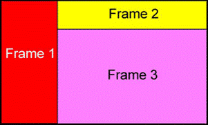
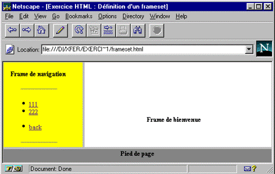
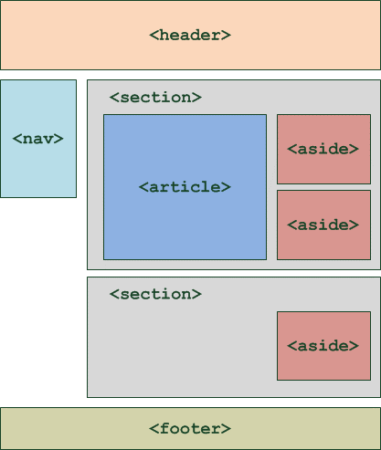
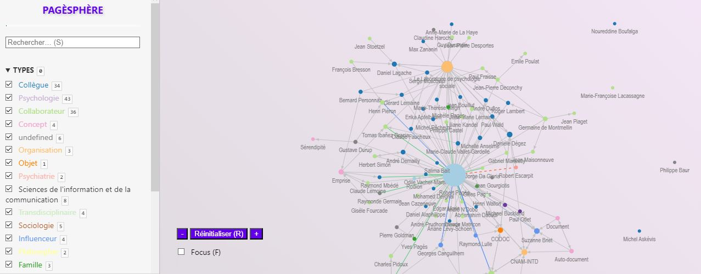

# Architecture de l’information
## Séance 2: Organologie d’un site web
*BUT INFONUM 3*
    Olivier Le Deuff

---

## Historique
- Autrefois étaient les *frames*
- Nécessité d’envisager ce travail dans une perspective historique.
 

---

## Structuration de la page
- Des logiques de *structuration* qui découpent la page
- Pensez les contenus
- Classifier avec le numérique
- Imaginer l'apparence (css)

---

## Critères ordinaires de classification dans les sites web

1. Alphabétique
2. Numérique
3. Chronologique
4. Géographique
5. Par tâches

---

## Type de classement (suite)

1. Par type d’audience
2. Par métaphore
3. Par popularité ou fréquence d’usage
4. Par pertinence
5. Personnalisée, selon les préférences des utilisateurs.

---

## Les différents types de structuration

1. **La hiérarchie** : Logique arborescente, Du général au particulier
2. **La matrice** : Organisation de type *tableau*
3. **La séquence** : Ordre logique ou chronologique

---

## La hiérarchie

La hiérarchie est l'une des méthodes les plus courantes pour structurer l'information. Elle est basée sur une logique arborescente.

- **Principe** : Organiser l'information du général au particulier.
- **Exemple** : Un site de commerce électronique peut avoir une catégorie principale "Vêtements", qui se divise ensuite en "Hommes", "Femmes" et "Enfants", et chaque sous-catégorie peut avoir d'autres subdivisions comme "Hauts", "Bas", etc.

---
## La hiérarchie (suite)
- **Avantages** :
  - Facilite la navigation et la recherche d'informations.
  - Permet une organisation logique et intuitive.
- **Inconvénients** :
  - Peut devenir complexe si trop de niveaux sont ajoutés.
  - Nécessite des choix d'affichage (menu déroulant, menu latéral, etc.)
- **Recommandation**
    - doit se coupler avec un moteur de recherche et des filtrages algorithmiques.

---

## La matrice

La matrice est une organisation de type *tableau* où l'information est structurée en colonnes et en lignes.

- **Principe** : Organiser l'information selon deux dimensions ou plus.
- **Exemple** : Un tableau de tarifs où les colonnes représentent les types de chambres et les lignes représentent les saisons.

---
## La matrice (suite)
- **Avantages** :
  - Permet de comparer et de croiser des informations.
  - Facilite la visualisation de données complexes.
- **Inconvénients** :
  - Peut être difficile à naviguer si trop d'informations sont présentées.
  - Doit être utilisée dans des cas mûrement réfléchis.

---

## La séquence

La séquence est une organisation linéaire de l'information, souvent utilisée pour guider l'utilisateur à travers un processus étape par étape.

- **Principe** : Organiser l'information dans un ordre logique ou chronologique.
- **Exemple** : Un tutoriel ou un guide d'introduction qui guide l'utilisateur étape par étape.

---

## La séquence

- **Avantages** :
  - Idéal pour les processus étape par étape ou les tutoriels ainsi que les enquêtes.
  - Assure que l'utilisateur reçoit l'information dans le bon ordre.
- **Inconvénients** :
  - Moins flexible que d'autres méthodes.
  - L'utilisateur peut se sentir contraint s'il souhaite sauter certaines étapes.
        - risque d'abandon.
- **Recommandations**
  - Permettre les pauses et les interruptions.
  - Ajouter des formes de gamification avec récompenses symboliques ou visuelles.

---

## Les modèles hybrides
 - **l'hyperdocument**
 - **le graphe**

---

## L'Hyperdocument

L'hyperdocument est un document électronique qui contient des hyperliens, permettant une navigation non linéaire entre différentes parties du document ou vers d'autres documents.

- **Principe** : Permettre une navigation flexible et interactive à travers l'information.
- **Exemple** : Wikipedia est un exemple classique d'hyperdocument où chaque article contient de nombreux liens vers d'autres articles pertinents.

---
## L'hyperdocument (suite)
- **Avantages** :
  - Facilite la découverte d'informations connexes.
  - Permet une exploration personnalisée en fonction des intérêts de l'utilisateur.
- **Inconvénients** :
  - Peut entraîner une "paralysie de l'analyse" si trop de liens sont proposés.
  - Risque de détourner l'utilisateur de son objectif initial.

---

## Le Graphe

Le graphe est une structure de données composée de nœuds (ou sommets) et d'arêtes (ou liens) qui connectent ces nœuds. Il est utilisé pour représenter des relations complexes entre différentes entités.

- **Principe** : Représenter des relations non hiérarchiques entre différentes entités.
- **Exemple** : Les réseaux sociaux comme Facebook ou LinkedIn utilisent des graphes pour représenter les relations entre les utilisateurs.

---
## Le Graphe (suite)
- **Avantages** :
  - Permet de visualiser des relations complexes.
  - Idéal pour représenter des réseaux ou des systèmes interconnectés.
- **Inconvénients** :
  - Peut devenir visuellement encombrant si trop d'entités et de relations sont représentées.
  - Nécessite des outils ou des logiciels spécialisés pour la visualisation et l'analyse.

---
## L'approche mixte
 - Offrir plusieurs moyens de navigation
 - Ne pas négliger l'orientation
 - Distinguée narration, orientation, navigation (J. Drucker)

---

### L'approche mixte : l'exemple de Cosma

---

### Organiser et classifier

- **Taxonomies** : Classification officielle et structurée
- **Folksonomies** : Classification basée sur les utilisateurs

---
## Folksonomies : définition

> Le terme de folksonomie est apparu récemment sur le web pour désigner le phénomène d’indexation des documents numériques par l’usager. On rencontre également fréquemment le mot tag qui désigne en quelque sorte un mot-clé. Le terme de folknologie est aussi employé, mais plus rarement. L’usage du mot folksonomie semble donc plus opportun. L’architecte de l’information Thomas Vander Wal a forgé ce terme en combinant la taxinomie (règles de classification, taxonomy en anglais) et les usagers (folk).
* Olivier LE DEUFF, « Folksonomies : les usagers indexent le web », [Bulletin des bibliothèques de France (BBF), 2006, n° 4, p. 66-70.](https://bbf.enssib.fr/consulter/bbf-2006-04-0066-002)

---
### Taxonomies vs Folksonomies

- Concurrence ou alternative?
- Les folksonomies comme méthode d’organisation alternative
- Et comme méthode de reconstruction catégorielle

---
## Dessiner, c'est gagner
### Wireframes

- Outils pour visualiser la structure d'un site
- Quelques sites dédiés: [Mockingbird](https://gomockingbird.com/home)
- Ne pas hésiter à utiliser papier, crayon et grand format

---

## A lire
* Drucker, J. (2008). Graphic Devices: Narration and Navigation. Narrative, 16(2), 121–139. http://www.jstor.org/stable/30219279
* Bien relever les différences conceptuelles.
* Pour en savoir plus sur J. Drucker :
    

---
## Références

- Ding & Lin, *Information Architecture. The Design and Integration of Information Spaces*. 2009. Morgan and Claypool Publishers
- Gluschko, *The Discipline of Organizing*. 2013. MIT Press

