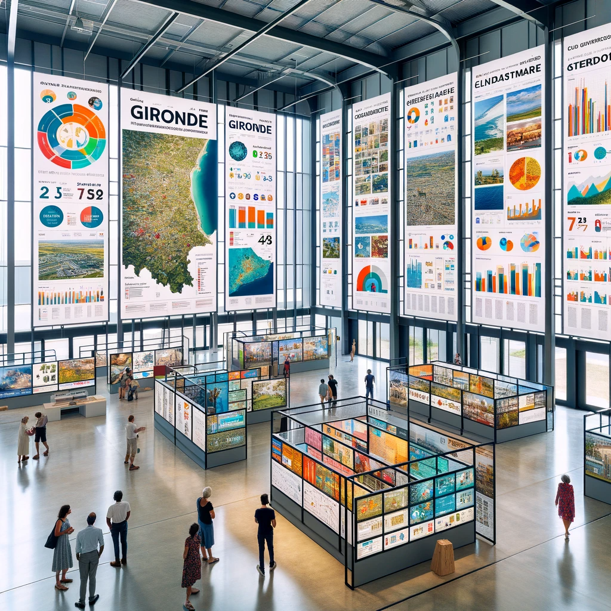

# Exposition : Planification et Organisation

## 1. État des Lieux de la To-Do List
- **Répartition par Groupe**: Analyse rapide des tâches assignées à chaque groupe.
- **Identification des Urgences**: Priorisation des tâches basées sur l'urgence, en particulier celles liées aux données.

## 2. Besoins Complémentaires d'Informations
- **Incorporation Visuelle**: Planification pour intégrer des photos de lieux, de personnes et des propos rapportés.
    -  Entretiens avec des personnes en charge ou concernées par les missions du département (veillez aux autorisations)
    - Incarner l'exposition.
- **Listing des Actions à Mener**: Établir une liste des actions nécessaires pour compléter l'exposition.
- **Illustration et Compensation des Données**: Utiliser des éléments visuels pour illustrer ou compenser les données insuffisantes.

## 3. Ressources Graphiques
- **Fonds de Carte de la Nouvelle Aquitaine**: Recherche et sélection de cartes adaptées.
- voir l'existant sur Open Street Map et autres sites dédiés.

## 4.. Scénarisation de l'Exposition
- **Titre et Découpage**: Définir le titre de l'exposition et le découpage thématique par panneaux.
- **Projection des Panneaux**: Début de la conception des panneaux (3 à 4 par groupe).

## 5. Maquettage
- **Utilisation de Feuilles A3 pour les Esquisses**: Création de maquettes initiales sur papier.
- **Panneau Artistique**: Inclusion d'un panneau unique à tendance artistique qui peut être basé sur des données. Voir les réalisations artistiques existantes et éventuellement inspirantes.

## 6. Types de Visualisations
- **Visualisations Imprimables vs Web/Interactives**: Décider des éléments à imprimer et ceux à présenter en format web ou interactif.
- **Versions Doubles**: Création de visualisations imprimées pouvant renvoyer à des versions interactives en ligne.

## 7. Affichage et Panneaux
En plus des panneaux thématiques, il faut prévoir :
- **Affiche Introductive**: Conception d'une affiche servant également de panneau introductif.
- **Panneau Final**: Création d'un panneau final regroupant les crédits, sources, licences et remerciements.

## 08. Choix Techniques
- **Logiciels pour la Conception**: Décision entre PowerPoint (orientation poster scientifique) ou InDesign.
- **Format A0**: Adoption du format A0 pour les affiches.
- **Cadre et Charte Graphique**: Développement d'un cadre réutilisable compatible avec la charte graphique du département.
- **Déclinaisons Visuelles**: Utilisation de couleurs différentes pour séparer les espaces thématiques.

