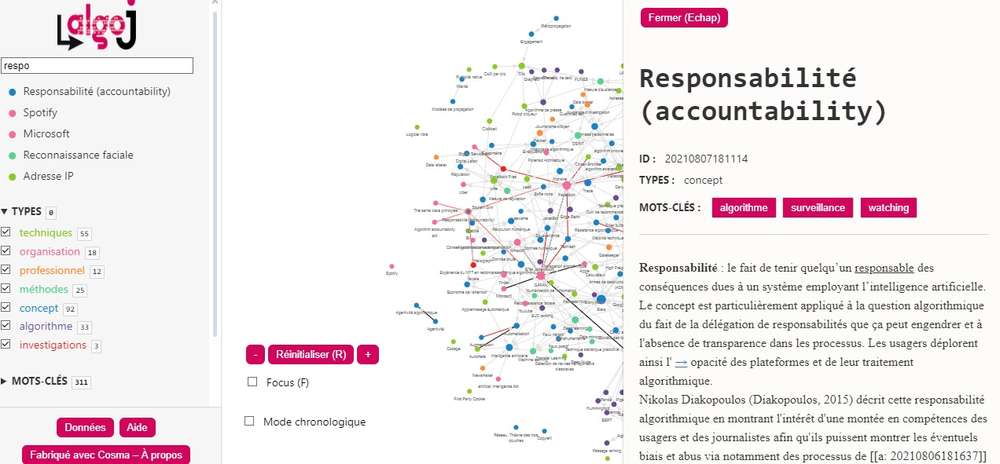

#  Vademecum du Hackathon sur les Algorithmes

## Introduction 

Bienvenue dans ce guide Vademecum destiné à l'organisation d'un hackathon axé sur les algorithmes. Inspiré par la [journée d'étude organisée par l'IJBA et le MICA](https://www.ijba.u-bordeaux-montaigne.fr/journee-detude-les-journalistes-au-defi-des-algorithmes/), qui s'est concentrée sur "Les journalistes au défi des algorithmes", ce guide vise à explorer la place croissante des algorithmes numériques dans divers domaines professionnels. En particulier, il s'attache à comprendre comment ces algorithmes façonnent notre monde, de la pratique journalistique à d'autres industries. 

## Premier Hackathon Consacré à l’Enquête Journalistique sur les Algorithmes

**Date :** 30 novembre

**Participants :** 70 étudiant.e.s en journalisme, InfoCom, et informatique de l’IJBA, de l’IUT Bordeaux Montaigne et de l’Université de Bordeaux.

**Lieu :** IJBA

**Partenaires :** Datactivist, Sud Ouest, Inria, Université de Bordeaux, CLEMI.

### Objectif

Collaboration, créativité et débrouillardise seront à l’honneur pour élaborer des stratégies d’enquêtes journalistiques sur des modèles algorithmiques utilisés par les administrations publiques ou les entreprises privées.

### Déroulement

- **Formation des Équipes :** Réparti.e.s en huit groupes, les futur.e.s journalistes, informaticien.ne.s et spécialistes de la documentation numérique.
- **Mission :** Concevoir des méthodes d’exploration d’un ensemble d’algorithmes.
- **Encadrement :** Aide d’une équipe d’encadrement multidisciplinaire.

### Contexte

A l’heure où les algorithmes envahissent tous les secteurs, il est crucial pour les professionnel.le.s de l’information, les scientifiques et les citoyen.ne.s de comprendre leur fonctionnement et leur impact.

### Cibles des Enquêtes

- Algorithmes d’aide à la décision, de détection des fraudes, d’attribution de prestations sociales.
- Algorithmes de recommandations d’achats, de classement des pages web, de distribution de l’information.
- Utilisés par la CAF, l’administration fiscale, ParcoursSup, Trouve mon Master, SNCF, Amazon, Netflix, Google, Facebook, X, ChatGPT, Midjourney, etc.

### Questions Clés

- Conformité à la loi, contrôle, production de biais, tromperie des consommateurs, propagation de fausses informations.

### Format de la Compétition

- **Matin :** Formation des équipes et choix de l’algorithme.
- **Journée :** Conception et documentation de la méthode d’enquête.
- **Présentation :** Dix minutes pour détailler l'approche.

### Jury et Récompenses

- **Présidé par :** Maelle Fouquenet de Datactivist.
- **Enjeu :** Le dossier gagnant poursuivra l’enquête avec l’aide de journalistes professionnel.le.s pour une publication dans Sud Ouest.

## Ressources Utiles

### Vidéos
- **Intervention d'Estelle Harry à Datarama**  
  [Estelle Harry à Datarama](https://www.youtube.com/watch?v=xvrr5X70puo&t=20400s)

- **Comment auditer des algorithmes d'IA, par Benoit Rottembourg**  
  [Auditer des algorithmes d'IA](https://www.youtube.com/watch?v=nlJuut_YskE)

### Articles et Publications
- **Ouvrir le code des algorithmes ne suffit plus**  
  [AOC Media - Ouvrir le code des algorithmes](https://aoc.media/opinion/2023/09/17/ouvrir-le-code-des-algorithmes-ne-suffit-plus/)

- **Rapport Bothorel**  
  [Rapport Bothorel](https://www.gouvernement.fr/upload/media/default/0001/01/2020_12_rapport_-_pour_une_politique_publique_de_la_donnee_-_23.12.2020_.pdf)

### Podcasts et Initiatives
- **Podcast du MIT "In Machine We Trust"**  
  [In Machine We Trust](https://forms.technologyreview.com/in-machines-we-trust/)

- **Algorithm Watch et le jeu Break the Algorithm**  
  [Algorithm Watch](https://algorithmwatch.org/en/) | [Break the Algorithm Game](https://algorithmwatch.org/en/break-algorithm-game/)

### Dernière minute ! L'enquête de la quadrature du net
[sur l'algorithme de scoring de la CAF](https://www.laquadrature.net/2023/11/27/notation-des-allocataires-lindecence-des-pratiques-de-la-caf-desormais-indeniable/)

### Organisations et Guides
- **Travaux de Datactivist**  
  [Datactivist SPoSGL](https://datactivist.coop/SPoSGL/sections/section10.html#1)

- **Guide Etalab sur les algorithmes publics**  
  [Guide Etalab](https://etalab.github.io/algorithmes-publics/guide.html)

- **Guide de Datapublica**  
  [Guide Datapublica](https://nextcloud.datactivist.coop/s/tqos5ppqGeEArDX)
- **European Centre for Algorithmic Transparency**
[Site du projet](https://algorithmic-transparency.ec.europa.eu/index_en)
[description par Algorithm Watch](https://algorithmwatch.org/en/dsa-explained)

Le Centre européen pour la transparence algorithmique (ECAT) a été officiellement inauguré à Séville, en Espagne, le 18 avril 2023. Ce centre joue un rôle majeur dans l'examen des algorithmes des principaux services numériques tels que Facebook, Instagram et TikTok. L'ECAT est intégré au Centre commun de recherche (CCR) de l'UE, un établissement scientifique de longue date qui mène des recherches pour soutenir une large gamme de politiques de l'UE, allant du changement climatique et de la gestion des crises à la fiscalité et aux sciences de la santé. Bien que l'ECAT soit intégré au *Joint Research Centre* (JRC), il a un focus dédié sur la Digital Services Act (DSA), aidant les législateurs à rassembler des preuves pour agir contre les plateformes qui ne prennent pas leurs obligations au sérieux​​.

Les responsables de la Commission décrivent la fonction de l'ECAT comme étant d'identifier des "preuves accablantes" pour renforcer l'application de la DSA. Par exemple, un système de recommandation basé sur l'IA qui diffuse un contenu discriminatoire malgré les affirmations de la plateforme concernée qu'elle a pris des mesures pour débiaiser ses sorties. Les chercheurs de l'unité sont chargés de trouver des preuves solides pour aider la Commission à établir des cas de violation du nouveau livre de règles numériques​​.

- **le graphe AlgoJ** (lexique consultable sous forme de graphe réalisé avec le logiciel Cosma)
    [Graphe](http://www.culturedel.info/cosmoscope.html)
    

### Contexte et Enjeux
- **Loi Pour une République Numérique** : Entrée en vigueur en 2017, mais les dispositions sur la transparence algorithmique sont peu appliquées. Les textes d'application datent de 2020 et sont peu connus. Ils sont simples dans leur intention mais complexes dans leur application. Les administrations ne savent pas toujours comment exiger des prestataires les informations nécessaires pour expliquer le fonctionnement d'un algorithme. Il y a également des enjeux de propriété intellectuelle. 

- **Transparence Algorithmique** : Nécessite de comprendre le contexte (à quoi sert l'algorithme), le processus administratif, le code (comment il est programmé), et les données utilisées. Sans ces éléments, l'algorithme n'est pas auditable et la redevabilité n'est pas complète. 

# Livrables Essentiels du Hackathon

## Livrable 1. : Rapport préliminaire d'Enquête sur l'Algorithme

### Quoi : Description et Contexte
- **Description des Algorithmes :** 
  - Typologie, fonctionnalités, et traitement effectué par l'algorithme.
  - Références scientifiques ou journalistiques liées à l'algorithme.
- **Contexte :** 
  - Contexte économique, technique, et éthique entourant l'usage de l'algorithme.

### Pourquoi : Objectif de l'Enquête
- **Hypothèse Principale :** 
  - Clarification de ce que l'enquête cherche à démontrer (biais, dysfonctionnements, dark patterns, etc.).
- **Intérêt pour le Lectorat :** 
  - Justification de l'intérêt et de la pertinence de l'enquête pour un public ciblé.

### Comment : Méthodologie et Résultats
- **Méthodologie d'Audit :** 
  - Approche détaillée pour l'audit de l'algorithme.
  - Premiers éléments de preuve appuyant l'hypothèse d'enquête.
- **Résultats Préliminaires :** 
  - Présentation de résultats tangibles démontrant l'intérêt de l'enquête.
  - Démos et données de démonstration si disponibles.

### Poursuite de l'Enquête et Limites
- **Pistes de Suite :** 
  - Potentialités de rétroingénierie et stratégies d'enquête complémentaires envisagées.
- **Processus de Documentation :** 
  - Description du processus de documentation de l'enquête.

### Annexes possibles
- **Documentation des Actions :** 
  - Récapitulatif des actions réalisées durant la journée du hackathon.
- **Données et Outils :** 
  - Ensemble de données obtenues et prototypes/scripts développés.

## Livrable 2. Présentation Synthétique en 5 minutes.
- **Contenu :** Présentation visuelle (PowerPoint ou équivalente) 
- **Objectif :** Résumer l'approche de l'équipe, la méthodologie, les résultats préliminaires et les pistes complémentaires envisagées.
