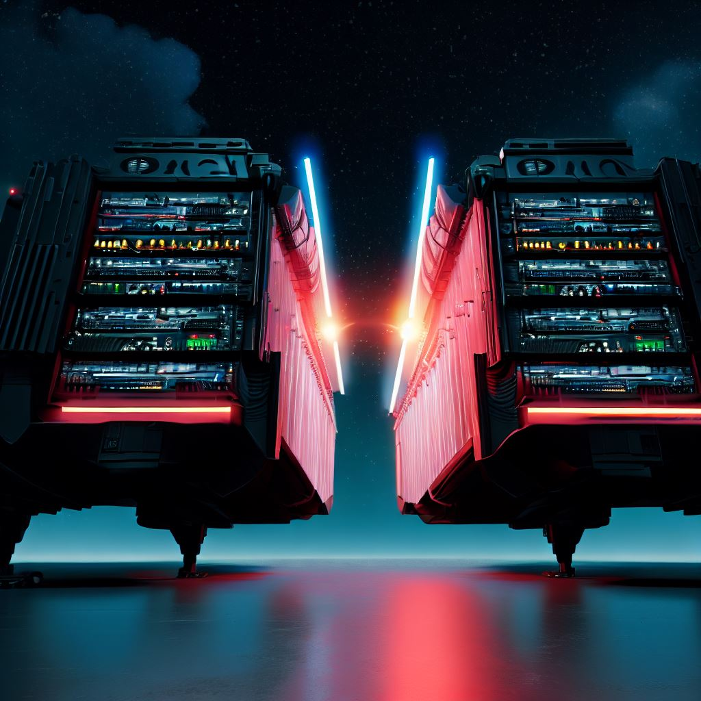
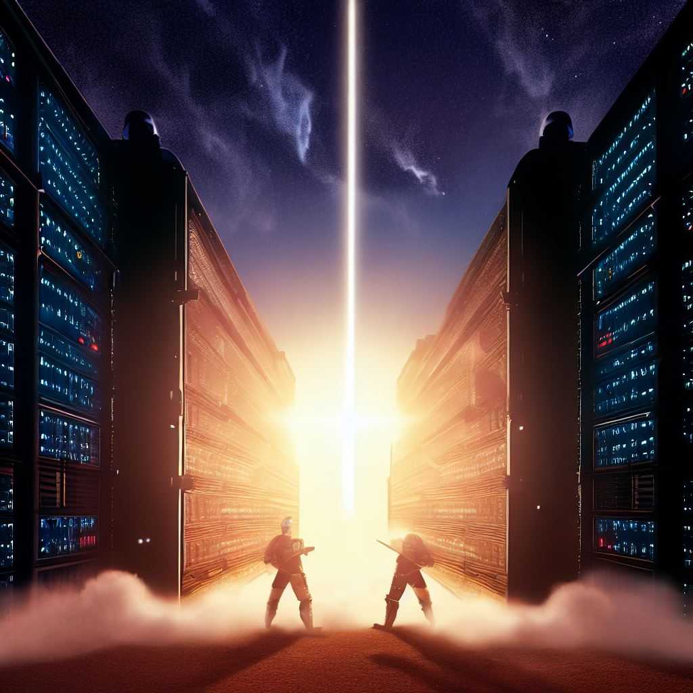
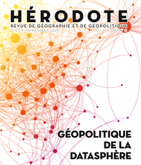

# **Souverainetés numériques**.

RSO partie 3.
*Olivier Le Deuff.*
**BUT 3 Infonum**

---
# 1. Définitions, contexte et enjeux

----

##  Définition de la souveraineté numérique

La **souveraineté numérique** fait référence à la capacité d'un pays ou d'un groupe de pays à exercer un contrôle indépendant sur ses propres *données*, *technologies* et *infrastructures numériques*.

---

##  Quels enjeux principaux ?

- **Indépendance technologique** : Ne pas dépendre des technologies étrangères pour des questions stratégiques.
- **Protection des données** : Assurer la sécurité des données des citoyens.
- **Économie** : Favoriser l'innovation et la croissance économique nationale.

---

## Défis économiques et techniques

- **Coûts élevés** : Développer des technologies nationales peut être coûteux.
- **Résistance des géants technologiques** : Les grandes entreprises peuvent ne pas vouloir perdre leur part de marché.
- **Interconnexion mondiale** : Difficulté à rester isolé dans un monde numérique interconnecté. 
  - problème d'interopérabilité alors que des normes sont requises
- Mise en cause de règles pénalisantes pour les géants du web et accusation de **protectionnisme** d'un côté.
- Positionnement présent également en Chine et en Russie pour s'opposer à l'hégémonisme et **impérialisme** américain dans le domaine.

---

#  Le Cloud Computing
- **Types Principaux** :
  - Infrastructure en tant que service (IaaS)
  - Plateforme en tant que service (PaaS)
  - Logiciel en tant que service (SaaS)

- **Exemple** : Amazon Web Services (AWS) est un exemple d'IaaS.

---
##  Exemples de souveraineté numérique

- **GAIA-X** : Projet européen pour une infrastructure de données sécurisée.
- **Systèmes d'exploitation nationaux** : Comme le système d'exploitation russe Astra Linux.
- **Services cloud locaux** : Pour éviter la dépendance à des fournisseurs étrangers.
- Réseaux d'information en parallèle ou en dehors d'Internet : Corée du Nord.

--- 
## Contexte :La montée en puissance du *techlash*
>Le "techlash" est un terme qui désigne le contrecoup ou la réaction négative du public à l'égard des grandes entreprises technologiques, en particulier celles basées dans la Silicon Valley. Cette réaction est souvent le résultat de préoccupations concernant la protection de la vie privée, la manipulation de l'information, la concentration du pouvoir économique, les impacts sociaux des technologies, et d'autres questions éthiques associées à l'ère numérique. Le techlash s'est manifesté de plusieurs manières, notamment par le biais de critiques publiques, de réglementations gouvernementales accrues, de poursuites judiciaires et d'un scepticisme croissant à l'égard des motivations et des actions des géants de la technologie. (ChatGpt)
- Phénomène croissant depuis [2019](https://www.lemonde.fr/idees/article/2019/12/31/2019-aura-ete-l-annee-du-techlash_6024442_3232.html)

---
# Réaction citoyennes
- Les révélations Snowden, les affaires Cambridge Analytica changent la donne.
- Entre réglementation et *empowerment*
- Nécessité d'équilibrer les *pouvoirs* au sein de l'UE.
---

# 2.  L'Europe et la souveraineté numérique

---

## Enjeux européens

- L'Europe reste dépendante des plateformes américaines et chinoises.
- Nécessité de protéger les données des citoyens européens.
- L'Europe doit renforcer sa capacité à innover et à investir dans le numérique.

---
## Localisation des données

- Difficulté de savoir si les données d'une entreprise sont réellement basées en Europe.
- Ambiguité sur les données de santé avec Microsoft.
- Enjeux de sécurité, de confidentialité et de conformité réglementaire.

---

# Propositions

- Création d'un espace européen des données.
- Renforcement de la régulation des plateformes numériques.
- Promotion de l'interopérabilité et des standards ouverts.

---
# Données de santé dans l'UE

- Les données de santé sont considérées comme des "données sensibles" selon le RGPD.
- Nécessitent des protections supplémentaires.
- Consentement explicite pour le traitement.
- Les États membres peuvent adopter des règles plus strictes pour la protection des données de santé.

**Référence** : [RGPD - Données sensibles](https://eur-lex.europa.eu/eli/reg/2016/679/oj)

---

## Mesures Européennes

- **Objectif** : Renforcer la souveraineté numérique de l'Europe.
- Incitations à l'**innovation**
- **Initiatives** : Réglementations strictes, investissements dans les technologies clés, promotion de normes ouvertes.

---

## Projets de loi (nouveaux et anciens)

- **Digital Services Act (DSA)** et **Digital Markets Act (DMA)** : Deux projets majeurs proposés par la Commission européenne.
- Objectif : Réguler les grandes plateformes numériques et garantir une concurrence équitable.
- Le **Rgpd**
- La **directive** sur la sécurité des réseaux.
---

# DSA (Digital Services Act)

- Proposition de règlement de l'UE pour réglementer les plateformes numériques.
- Renforce la transparence, la responsabilité et la protection des consommateurs.
- S'applique à toutes les entreprises fournissant des services numériques dans l'UE.
- Sanctions sévères pour non-respect.

**Référence** : [Commission européenne - DSA](https://ec.europa.eu/info/strategy/priorities-2019-2024/europe-fit-digital-age/digital-services-act-ensuring-safe-and-accountable-online-environment_fr)

---

# DMA (Digital Markets Act)

- Proposition de règlement de l'UE pour réglementer les grandes plateformes en ligne.
- Garantit un comportement équitable et ouvert des plateformes.
- Interdit certaines pratiques anticoncurrentielles.
- Promeut la concurrence et l'innovation.

**Référence** : [Commission européenne - DMA](https://ec.europa.eu/info/strategy/priorities-2019-2024/europe-fit-digital-age/digital-markets-act-ensuring-fair-and-open-digital-markets_fr)

---
# Règlement général sur la protection des données (RGPD)

- Adopté en 2016, applicable depuis 2018.
- Protège les données personnelles des citoyens de l'UE.
- Oblige les entreprises à garantir la confidentialité des données.
- Consentement explicite nécessaire pour la collecte de données.

**Référence** : [RGPD - Site officiel](https://eur-lex.europa.eu/eli/reg/2016/679/oj)

---

# Directive sur la sécurité des réseaux et de l'information (NIS)

- Adoptée en 2016.
- Première législation de l'UE sur la cybersécurité.
- Oblige les États membres à améliorer leur cybersécurité.
- S'applique aux opérateurs de services essentiels et aux fournisseurs de services numériques.

**Référence** : [Directive NIS - Site officiel](https://eur-lex.europa.eu/legal-content/FR/TXT/?uri=CELEX%3A32016L1148)

---

# Rôle de la Commission Européenne

- **Margrethe Vestager** : Vice-présidente exécutive de la Commission européenne.
- Responsable de la politique de concurrence et du portefeuille "Une Europe prête pour l'ère numérique".

---

# Rôle de la Commission Européenne

- **Thierry Breton** : Commissaire européen au Marché intérieur depuis 2019.
- Homme d'affaires, informaticien et homme politique français.
- Ministre de l'Économie, des Finances et de l'Industrie (2005-2007).
- En charge de la politique industrielle, du marché unique, du numérique, de la défense et de l'espace.

**Référence** : [Wikipedia - Thierry Breton](https://fr.wikipedia.org/wiki/Thierry_Breton)

---
# Cybersécurité et souveraineté : rôle de l'ANSSI
L'**ANSSI** (Agence nationale de la sécurité des systèmes d'information)est l'autorité nationale en matière de sécurité et de défense des systèmes d'information en France. Sa **Mission** est de protéger les informations stratégiques de l'État et des entreprises françaises.
- **Activités** :
  - Prévention des risques numériques.
  - Réponse aux incidents de sécurité.
  - Certification de produits et services de sécurité.
  - Sensibilisation et formation.

> Référence : [Site officiel de l'ANSSI](https://www.ssi.gouv.fr/)

---

# 3. Les nouvelles tensions entre Chine et Europe

---

# Tensions entre l'Europe et la Chine 

L'Europe et la Chine ont des **visions divergentes** sur la gouvernance d'Internet et la souveraineté numérique.

- **Contrôle d'Internet** :
  - Chine : Forte censure et contrôle étatique.
  - Europe : Promotion de la liberté d'expression et des droits de l'homme.

---
 # Europe versus Chine

- **Protection des données** :
  - Chine : Utilisation des données pour la surveillance.
  - Europe : Règlementation stricte (ex: RGPD) pour protéger la vie privée.

- **Technologies clés** :
  - Tensions autour des équipements 5G (ex: Huawei).
  - Préoccupations sur la dépendance technologique.

- **Initiatives** :
  - Europe : Recherche d'autonomie stratégique.
  - Chine : Initiative [**Belt and Road**](https://en.wikipedia.org/wiki/Belt_and_Road_Initiative) incluant le numérique.

> Ces tensions reflètent des **valeurs et intérêts divergents** dans le domaine numérique.

---
# Le nouveau leadership chinois

- Innovations encouragées et non cadrées éthiquement
- Une **dynamique indéniable**. (Lire Liu Cixin)
- Les nouvelles dépendances à venir en matière d'*IA* et d'*informatique quantique*.

----
# A lire

