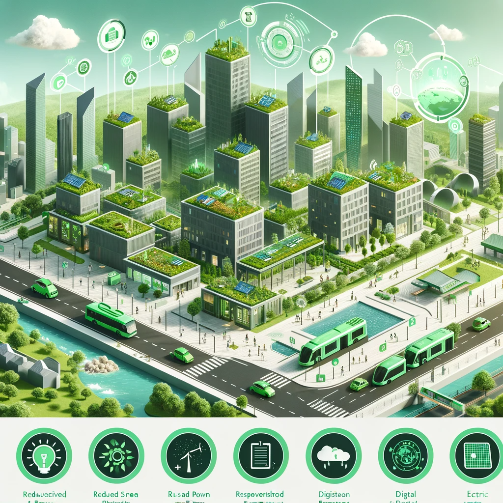
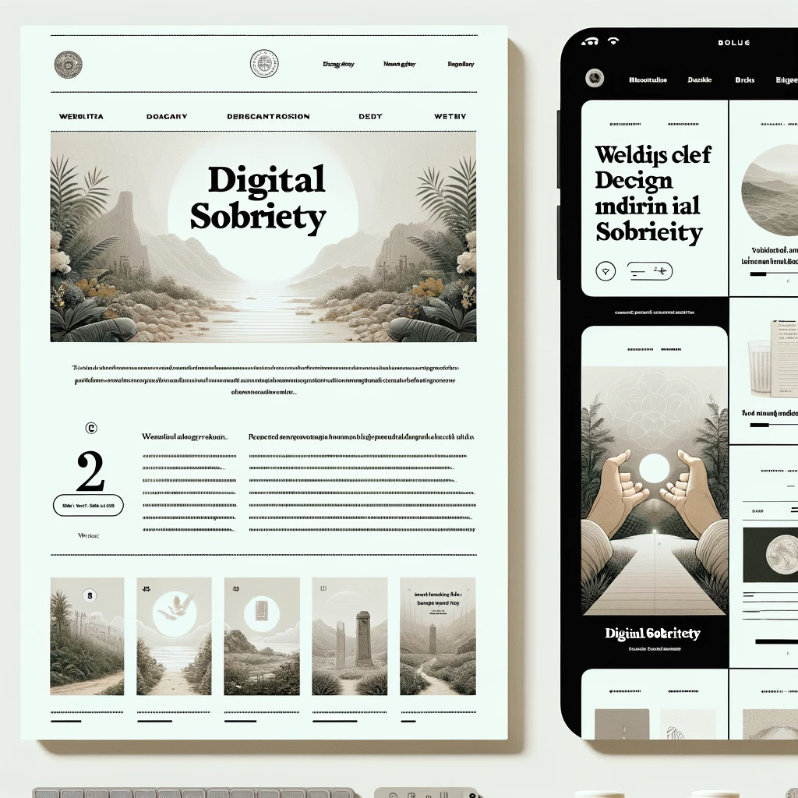

# Sobriété Numérique
## pour un Numérique Responsable ,
_Olivier Le Deuff
BUT INFONUM 3
*Licence CC By*

---

# Sobriété Numérique : Concepts, Objectifs et Méthodes

---

## Définition de la Sobriété Numérique
- Parfois qualifiée de *frugalité* numérique
- Vise à **réduire l'impact environnemental** du numérique en limitant ses usages.
- Fait partie de l'**informatique durable**.
- Englobe des pratiques et réflexions assez diverses.

---

## Historique et Évolution

- Apparu en **France il y a une dizaine d'années**.
- Promouvoir l'**éco-conception des projets numériques** et les **technologies low-tech**. (*lean ICT*)
- Initié par **Frédéric Bordage**, ingénieur et fondateur de [GreenIT](https://www.greenit.fr)

---

## Impacts Environnementaux du Numérique

- Contribution significative à **l'augmentation de l'empreinte carbone mondiale**.
- Empreinte comparable à **2 à 3 fois la taille de la France**.
- Plusieurs chiffres et comparaisons circulent dont l'équivalence avec le transport aérien.

---

# Sobriété Numérique : Définition et Stratégie
### Selon The Shift Project

- **Définition** : Acheter moins d'équipements, réduire les usages énergivores.
- **Stratégie** : Réduire la consommation d'énergie, stabiliser l'empreinte environnementale.

---

# Sobriété Numérique : Enjeux et Réflexion
### Perspectives Globales

- **Conscience et Action** : Sensibilisation, prise en compte de l'impact environnemental.
- **Réflexion Socio-Économique** : Questionner et adapter les comportements d'achat et consommation.
- **Enjeux Globaux** : 
  - **Pays en Développement** : Gains économiques/environnementaux, infrastructures.
  - **Pays Développés** : Surconsommation, impacts environnementaux et sociaux.

---
# un contexte économique
- qui oblige à mieux gérer :
    Cf. la [tribune de Frédéric Marchand dans Le Monde](https://www.lemonde.fr/idees/article/2023/10/09/numerique-comment-envisager-une-tech-plus-sobre-sans-peser-sur-la-performance-economique-des-entreprises_6193262_3232.html)

--- 
# Piste 1.  Optimiser les sites web

---
## 1. Optimisation des Images et Médias

- Utiliser des formats d'images modernes comme **WebP** pour un meilleur rapport qualité/poids.
- Mettre en œuvre le **chargement paresseux (lazy loading)** pour les images et vidéos.
- Utiliser des outils de **compression d'images** sans perte pour réduire la taille des fichiers.

---

## 2. Réduction du Poids des Pages

- Minimiser le HTML, CSS, et JavaScript avec des outils comme **Minify** ou **Uglify**.
- Éviter l'utilisation excessive de frameworks et de librairies lourdes.
- Utiliser la **mise en cache côté client** pour stocker les ressources réutilisables.

---

## 3. Performance et Éco-conception du Backend

- Choisir des langages et frameworks **efficaces en termes de performance**.
- Réduire les requêtes serveur et optimiser les bases de données.
- Utiliser l'**architecture serveurless** ou des solutions d'hébergement **éco-énergétiques**.

---

## 4. Conception Mobile-First et Responsive Design

- Prioriser le design mobile-first pour des sites **plus légers et plus rapides** sur mobile.
- Utiliser des requêtes média (media queries) pour **adapter le contenu** à différentes tailles d'écran.
- Optimiser les éléments d'interface pour une **utilisation efficace sur mobile**.

---

## 5. Surveillance et Analyse des Performances

- Utiliser des outils comme **Google Lighthouse** (Outil de SEO à la base) pour évaluer les performances et l'accessibilité.
- Suivre les métriques comme le **Time to First Byte (TTFB)** : mesure utilisée comme une indication de la réactivité d'un serveur
- et le [**Largest Contentful Paint (LCP)**.](https://fr.semrush.com/blog/core-web-vitals-lcp/) : mesure la vitesse des pages. Il indique le temps nécessaire au chargement du principal contenu d'une page.
- Mettre en place une **stratégie de test et d'optimisation continue** pour maintenir des performances élevées.

---
# Piste 2 Mieux gérer les données

## Gouvernance Data Responsable
- Importance de la gouvernance des données
- Stratégies pour une utilisation responsable

---

## Solutions Technologiques Orientées Usages
- Simplification des systèmes d'information
- Optimisation des flux de données
- Impact du stockage des données
- Prioriser les données à forte valeur ajoutée
- distinguer les formats de conservation et de mise en ligne
---

## Catalogue Unique de Données
- Réduction des doublons
- Centralisation et accessibilité des données
- stratégie de moissonnage avec des protocoles.
- attention au risque de plateformisation

---

## Standardisation des Données
- Importance de la normalisation des données
- Facilitation du travail de synthèse et analyse

---

## Documentation des Métadonnées
- Rôle des métadonnées dans la gestion des données
- Amélioration de l'accès et de la qualité des données
- Filtrage des données par temps et lieu
- Réduction du volume de données stockées

---

## Accès aux Données via APIs
- Réduction du volume de données téléchargées
- Mise à jour automatique des données

---

## Quid des IA ?
- Peut-on imaginer des IA light ?
    - avec des solutions qui fonctionnent sur des machines personnelles ?
        - Voire LAMA 2.
