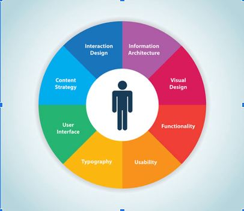
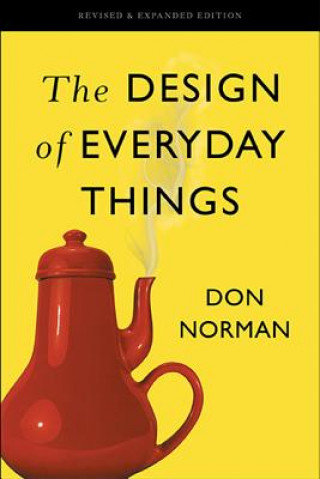

# Architecture de l’information et UX Design
## Du concept à la réalisation

Olivier Le Deuff
*BUT infonum 3*

---

# Un problème à résoudre

- A la base, il y a une *problématique*.
- Proposer une manière de comprendre le problème
    - en intégrant les usagers.
    - en pensant les contenus en conséquence
    - dans un contexte spécifique

---

# Une pensée systémique

- Les systèmes les plus efficaces nous font utiliser des choses dont on n’a pas besoin.
- Evolution de la pyramide de Maslow.
- Développer des interfaces pour répondre à des besoins *informationnels* et *émotionnels*

---

# Introduction du concept d'UX par Don Norman

- Psychologie cognitive (*the design of everydays things*).
- Rejoint Apple: Human interface -> User experience.

---

# User experience architect’s office

- Changement de *perspective*.
- De l’orientation *objet* à l’orientation *usager*.
- Dynamique impulsée avant le retour de Steve Jobs.

---

# Vidéos de Don Norman

[Don Norman, the term UX](https://www.youtube.com/watch?v=9BdtGjoIN4E)

[Don Norman, about the design Makes Happy](https://www.youtube.com/watch?v=RlQEoJaLQRA)

---

# Extension du sens

> « J’ai inventé l’expression car je pensais que Interface humaine (Human Interface) et utilisabilité (usability) étaient trop limitées : je voulais couvrir tous les aspects de l’expérience d’une personne avec un système, en considérant le design industriel, le graphisme, l’interface, l’interaction physique et le manuel(d’utilisation).Depuis, l’expression s ‘est diffusée énormément, tellement qu’elle a commencé à perdre de son sens. » (Norman)

---

# Le principe : proposer une expérience

- Penser l’*expérience* d’abord.
- Jouer sur le registre *émotionnel*.
- Expérience agréable, **envie de recommencer**.

---

# La concrétisation des Interfaces graphiques

- Informatique professionnelle.
- Informatique domestique.
- Evolutions de l’usager.

---

# L’usager est-il réellement au centre de l’expérience ?

- Usager 2.0 ? Usacteur ? Usager-concepteur ?
- Quelle éthique au final ?

---

# L’expérience n’est pas la tâche !

- La tâche a un début et une fin (faire un achat par 
exemple)
  -   Possibilités de les découper en microtâches
  - L’expérience ne se découpe pas aisément.
  - On peut multiplier les tâches… 
-   Il est déconseillé de multiplier les expériences différentes.

---

# Définition de la tâche

> « Recouvre tous les éléments d'utilisation du produit interactif: la façon dont on le ressent dans ses mains, dont on comprend son fonctionnement, ce qu’on ressent lors de son utilisation. S’il sert bien ses fins et comment il s’intègre bien dans son contexte d’utilisation.» (Alben)

---

# Deux logiques, deux esprits

- D’un côté, une logique **pragmatique** et **ergonomique** parfois, basée sur la rationalisation des actions.
- De l’autre, une logique **expérientielle**, **émotionnelle** et potentiellement irrationnelle.

---

# Importance et influence du design

- Fonction, Sens, Economie.

---

# Design d’expérience

- Particularités du numérique.
- Plasticité des formes 
- Diversité des usages 
- Fractures et microfractures 
- Logiques d’innovation (ascendante ou imprévues)

---
# la question de l'empathie
- A distinguer de la sympathie
- Il s’agit de se mettre à la place d’une autre personne
- Sans nécessairement de dimension affective.
- Repose sur des enquêtes et analyses.

--- 
# Méthodes

- Enquêtes qualitatives/quantitatives.
- Observations participantes.
- Observations participantes
- Echantillonnage d’expériences (cahiers d’utilisateurs sur plusieurs semaines avec des questionnaires à intervalle régulier)

---

# Le but est ensuite

- De définir une typologie d’usagers
- De créer des personas
- De produire des storyboards
     - Voir le chapitre  13, de Rosenfeld, Morville
     - Voir le passage sur les Wireframes, blueprints

---

# Le prototypage

- Concevoir une forme de base.
- Prototypes papier.
- Maquettage.

---

# Prototype Fonctionnel

- Envisager la réalisation technique.
- Cahier des charges.
- Bêta testeurs.

---

# 10 piliers de l’expérience utilisateur (1)

1. L’Utilisateur a toujours raison : se remettre en perspective par rapport à ce que l’Utilisateur, le vrai, adopte comme usage ; être capable de changer son propre prisme de perception d’une interface.
2. Comprendre l’Utilisateur : tout doit partir de l’Utilisateur final, de ces attentes, du contexte dans lequel il est et dans lequel on le demande de se projeter.
3. Eviter les solutions toutes faites : chaque cas est et doit être unique ; analyser une situation, la comprendre et ensuite y répondre avec une solution conçue pour.
4. La forme découle du fond : l’interface doit être le moyen, l’objet qui permet de comprendre le message ; une ergonomie doit être pensée en fonction du besoin, du vrai besoin.
5. Le contenu est roi : avant de penser ou de remettre en cause une interface, il est essentiel de penser avant tout au contenu.

---
# 10 pilliers (2°)
6. Innover et ne pas imiter : innover fait parti de l’ADN de l’expérience utilisateur (UX), créer pour se différencier.
7. Une interface accessible par tous et pour tout : ne jamais oublier la pluralité des utilisateurs, de leur équipements et de leurs comportements.
8. Imaginer avant de créer : une bonne réflexion en amont de tout projet est essentielle.
9. Comprendre l’objectif : garder en tête la finalité, le but ; comprendre les enjeux pour mieux les servir.
10. Apprendre de ses erreurs: on apprend en marchant… n’hésitez pas à courir !
- [Source](https://www.anthedesign.fr/creation-de-sites-internet/experience-utilisateur/)

---
# Crédits

- Image de fond. Cactus. cactus Photo de <a href="https://unsplash.com/fr/@scottwebb?utm_source=unsplash&utm_medium=referral&utm_content=creditCopyText">Scott Webb</a> sur <a href="https://unsplash.com/fr/photos/hDyO6rr3kqk?utm_source=unsplash&utm_medium=referral&utm_content=creditCopyText">Unsplash</a>
- Licence CC by Le Deuff 2023
  
