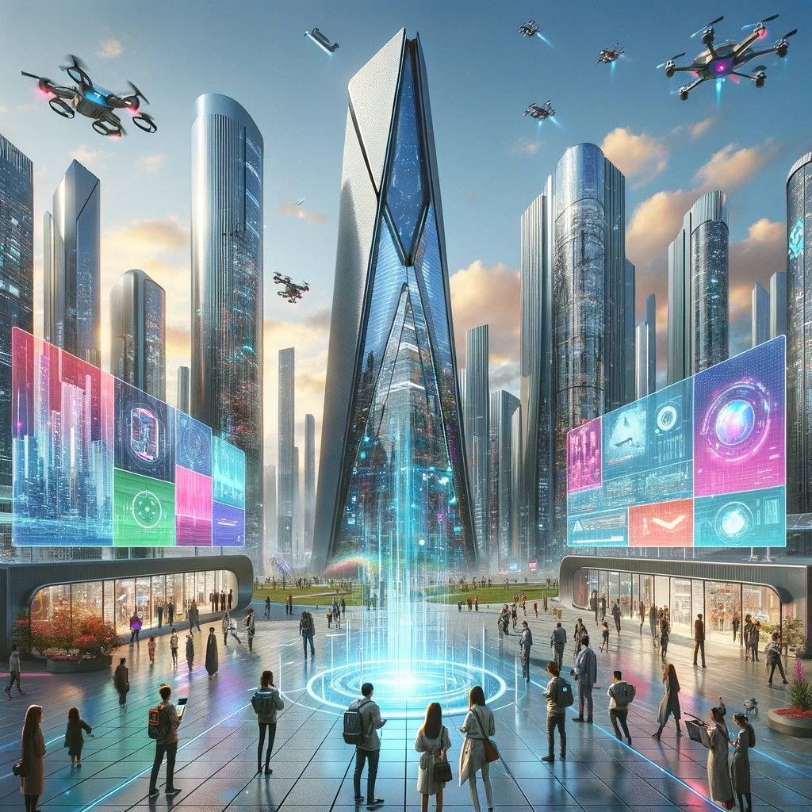
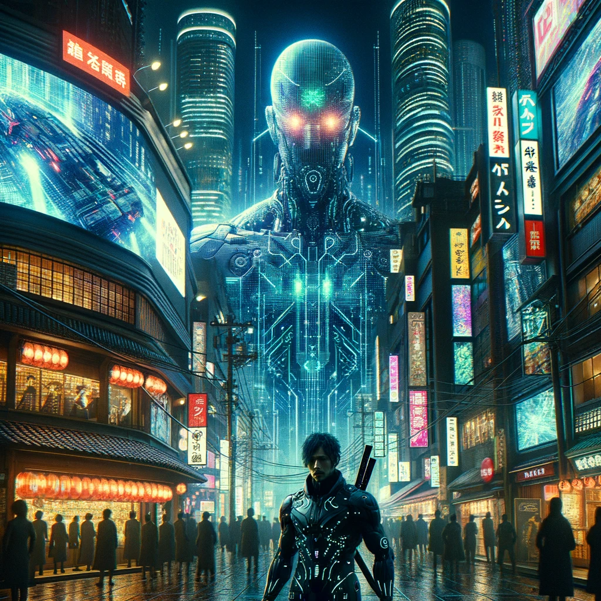

# Architecture de l’information
## L'esprit transmédia dans la machine
BUT INFONUM 3.
Olivier Le Deuff
*Licence CC By*
Crédit image : Dall-E

---

# Une évolution de l’Architecture de l'information

- Passage d'un canal de communication spécifique à une approche transmédia
- Changement non pas de nature, mais de pratique (Resmini et al., 2012)
- Incontestablement, l’AI a changé, et sa pratique également.
    -   Voir le texte de Rémini https://edc.revues.org/5380
    - Lire également le chapitre sur le transcanal dans *AI chez de Boeck*

---

# L'influence des supports
>Quant à la manière dont elle a changé, le fait d’être centré sur un canal précis de communication ou sur une approche transmédia est probablement ce qui distingue le plus les deux AI. Ce n’est certainement pas une différence de nature (Resmini et al., 2012) mais de pratique. Au lieu de se centrer sur la construction du sens, selon la formulation initiale de Wurman (Wurman, 1997), les premiers architectes de l’information avaient choisi de définir leur discipline par leurs réalisations, essentiellement des sites Web. Progressivement, ce qui était une manière tout à fait acceptable de définir une pratique (que construisez-vous ?) est devenue une définition paralysante caractérisée par des réalisations, des outils et des méthodes (vous êtes ce que vous construisez). Les frontières de l’AI qui étaient poreuses sont devenues étanches. [(Resmini, 2013)](https://journals.openedition.org/edc/5380)

---

# Construire du sens
>La première caractéristique de l’AI est abstraite : il s’agit de *construire du sens* en structurant et en organisant des structures de l’information. Les éléments physiques de l’AI comme la navigation ou la recherche sont comme des panneaux indicateurs dans un système d’orientation : des éléments qui participent d’un tout mais qui, même quand elles sont complètement collectées, ne réussissent pas à devenir le tout. L’AI est un processus de construction du sens et de l’espace dans le monde numérique et physique, où le caractère éphémère des artefacts et leur flux permanent créent des états d’incertitude et de déséquilibre qui doivent être neutralisés pour *éviter une dégradation de l’expérience-utilisateur*. (Resmini, 2013)

---

# Multicanal versus transcanal

- Le *multicanal* repose sur des actions qui se déroulent en *parallèle* en fonction des spécificités du canal.
- Le transcanal pense la diffusion des contenus de *façon complémentaire*: 
    - Peuvent être tour à tour mobilisé ordinateur et smartphone par exemple

--- 

## 5 Principes d'une analyse *transcanal*

1. Rendre **explorable et appropriable** (place-making) : favoriser l’exploration et la découverte de l’ensemble des ressources proposées et faciliter l’appropriation du territoire proposé.
2. Rendre **cohérent** (consistency) : fournir à l’utilisateur des types de catégories qui soient adaptés a lui et à la tâche.
3. Rendre **souple et robuste** (resilience) : faire que l’espace informationnel s’adapte à chaque contexte d’usage (lieu, dispositif) et aux  différents besoins ou stratégies de recherche des utilisateurs, tout en maintenant son organisation globale.
4. Rendre **simple** (reduction): faciliter la tâche de l’utilisateur en organisant et simplifiant l’organisation des contenus.
5. **Coordonner**(correlation) : établir des liens entre éléments répondant a des buts explicites de l’utilisateur ou à des besoins latents de celui-ci ou lui fournissant des connexions inattendues. Mais éclairantes

---

## 1. Rendre appropriable

- Un nouvel arrivant doit pouvoir s’orienter et se diriger suffisamment sans expérience préalable.
- La conception de l’espace informationnel doit donc intégrer une aide adéquate — implicite ou explicite — à la navigation, à l’orientation
et à la découverte des différents endroits (volets, sections. modules, etc.) que ce territoire recèle.

---

## 1.(suite) Permettre de construire sa place
- L’architecture informationnelle laisse chaque utilisateur construire sa propre place dans cet espace. 
    - Cette caractéristique présuppose la possibilité pour l’utilisateur d’agir sur son environnement au sein de l’architecture informationnelle, de l’adapter
- Une certaine persistance de l’effet des actions de l’utilisateur sur son environnement d’une visite à l’autre. 
    - Exemple : l’identification (création initiale d’un nom d’usager que l’on redonne à chaque visite) est un moyen classique pour garantir que les actions d’adaptation et d’usage seront conservées de visite en visite.

---

## 2. Rendre cohérent
- Importance de l’organisation de l’information
- Classification et taxonomies
- Choix d’un thésaurus multisites (voir Remini)

-- -

## 3.. Veiller à la souplesse et à la robustesse
- Il faut que ça marche
- Il faut que ça s’adapte
- Nécessité de choix d’infrastructures reconnues :
    - CMS stable ou développement à partir de technologies stables
    - Avec des potentialités d’innovations et d’usages adaptées ou renouvelées

---

## 4. Simplifier
- Réduire les choix de façon à éviter une déperdition
- La multiplicité des choix peut générer une désorientation

----

## 5. Corréler
- Organiser une continuité d’information sur différentes interfaces.
- Parvenir à suivre l’utilisateur.

----
# Concevoir l'esprit transmédia
- Reprendre l’esprit premier de la culture Geek (voir David Peyron)
- Esprit dime novels
- Une culture fan ouverte
---

## Raconter des histoires à travers l'esprit dans la machine
- 
- Imaginer et scénariser (cohérence d’ensemble)
- Laissez ouvert (souplesse) et rendre possible les partages et les intégrations (Corrélation)
- Susciter le désir d’en savoir plus (captation d’attention)

##

>« les processus mentaux, c’est-à-dire les fantômes, ne peuvent en effet être étudiés séparément des processus physiques, à savoir la machine. » (Rémini, 2013)

---

# Un positionnement hybride
- Référence à Ghost in the Shell et aux travaux de Ryle
- Ryle G., (2000), *The Concept of the Mind*, University of Chicago Press

---

# L’avenir de l’AI (couplée à l’AI)
- Exploration de la frontière entre l'humain et le non-humain
- Qu'est-ce qui constitue l'humanité ? (*Ghost in the Shell* et les réflexions de *Marcello Vitali-Rosati*)
- Architecture de l’information orientée vers ces questionnements philosophiques

---
## Ghost in the shell
>De la même manière, les cyborgs de Ghost in the Shell sont un moyen pour Masamune Shirow d’explorer la très fine frontière entre l’humain et le non-humain. Qu’est ce qui fait l’humanité d’un être humain quand la différence entre l’humain et le non-humain est beaucoup plus de nature philosophique que physiologique ? Que signifie vraiment le terme « humain » quand l’esprit peut être copié, voire piraté, et que le corps peut être remplacé ? Il n’y a pas vraiment de réponse définitive à cette question mais plutôt une allusion au fait que le major Kusanagi, piégée par elle-même, se pose les mauvaises questions. Il n’y a en fait ni fantôme ni machine, seulement une différence d’être.
C’est dans cette direction que se dirige l’architecture de l’information.

