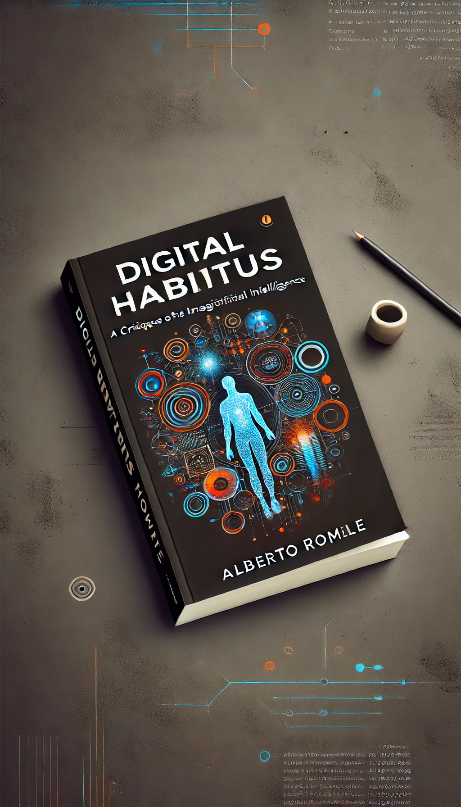

# Habitus Numérique : Une Critique des Imaginaires de l'Intelligence Artificielle
## Etude de l'ouvrage d' Alberto Romele

---

## Introduction

- *Habitus Numérique* : Une Critique des Imaginaires de l'Intelligence Artificielle
    - Reprise du concept de Bourdieu et de la pensée de Panofsky adaptée au contexte *digital*
- Focus sur l'IA, les algorithmes et les transformations digitales
- Examen critique de l'impact culturel et des implications sociétales

---

## Machines Technologiques et Habitus

- Les technologies comme machines à habitus
- Services personnalisés vs. indifférence à l'individualité
- Attentes culturelles et efficacité technologique

---

## Imaginaires de l'IA

- Rôle des imaginaires culturels dans la formation des perceptions
- Attentes, espoirs et peurs concernant l'IA
- Impact sur la croyance dans les capacités technologiques

---

## Efficacité Matérielle et Symbolique

- Symbiose entre dimensions matérielle et symbolique
- Tournant empirique dans la philosophie de la technologie
- Conditions de fonctionnement des artefacts technologiques

---

## Examen Critique de l'IA

- Besoin d'une perspective critique sur les imaginaires de l'IA
- Promotion de la résistance aux habitudes numériques
- Comprendre l'IA dans les contextes culturels et sociétaux

---

## Études de Cas et Exemples

- Analyse de technologies spécifiques d'IA et de leur impact sociétal
- Exemples de divers domaines tels que la santé, la finance et la gouvernance
- Illustrations de la façon dont l'IA façonne et est façonnée par les imaginaires culturels

---

