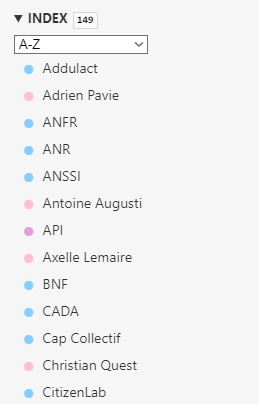

L'Open Data Sphère est un graphe qui connecte plusieurs points de manière logique autour du thème des données ouvertes. Chaque point du graphe représente une fiche. Pour accéder à une fiche, il suffit de cliquer sur le nom de l'entité.

## Contenu d'une fiche

- **Nom**
- **Type**
- **Mots-clés** liste de tags.
- **kesako** : courte description
-**link**: une url peut être mentionnée
- **Description** : contient des liens internes et externes
- **Liens** : internes et rétroliens

## Options du graphe

- **Rechercher** : par mot-clé ou nom
- **Types** : 6 catégories disponibles
- **Mots-clés** : filtrage par mots-clés
- **Index** : liste triable de toutes les fiches
- **Vues** : changement de perspective
- **Paramètres du graphe** : ajustements d'affichage
- **Aide** : liste de raccourcis

## Navigation

Vous pouvez zoomer de différentes manières. Les nœuds sont organisés par un algorithme de simulation de forces. Ajustez l'affichage via les paramètres. L'affichage est compatible avec tous les écrans, mais pas optimisé pour les mobiles.

## Astuces et conseils

Arthur Perret, le concepteur de Cosma donnait quelques astuces pour mieux naviguer :
>**Astuce :** quelques pressions sur la touche `Espace` permettent de « déplier » progressivement un graphe emmêlé. 
Le graphe n'est pas figé, les nœuds peuvent donc être déplacés par cliquer-glisser. Ils restent soumis en permanence à la simulation, donc il n'est pas possible de les disposer manuellement de manière arbitraire.

>L'affichage du graphe peut être modifié de manière temporaire via les contrôles placés sous Paramètres du graphe dans le panneau latéral gauche. Pour modifier l'affichage de manière permanente, modifiez les valeurs par défaut des paramètres correspondants dans la configuration.

>**Astuce :** modifiez la force et la distance maximale entre les nœuds pour adapter l'affichage à la résolution et la taille de votre écran. Ajoutez une force d'attraction vers l'axe vertical/horizontal pour resserrer le graphe et ramener les nœuds isolés plus près du centre.
