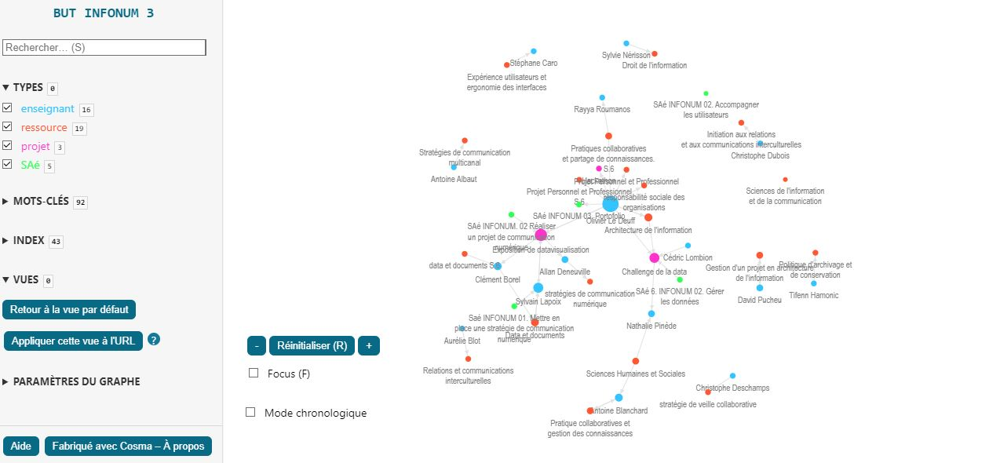
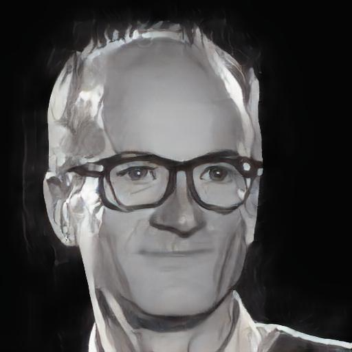
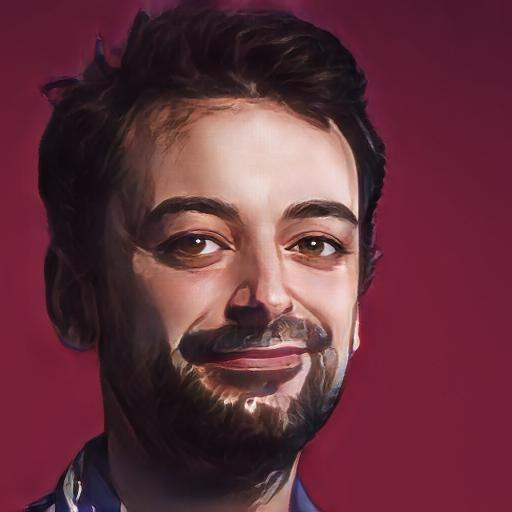
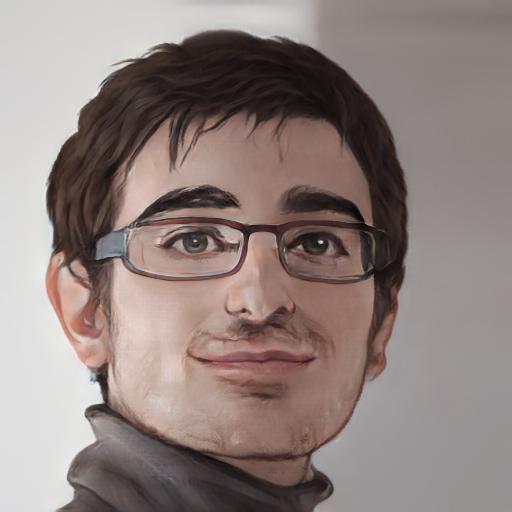
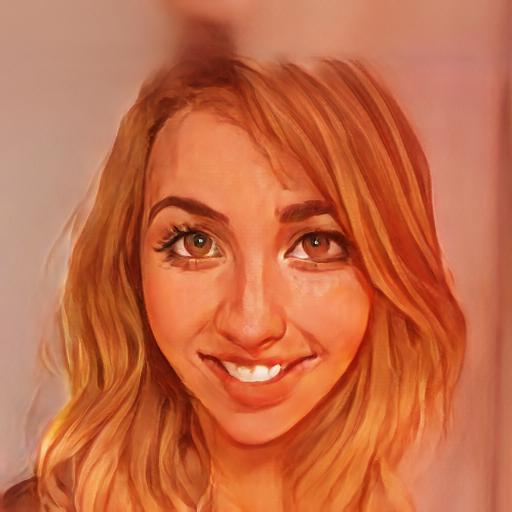
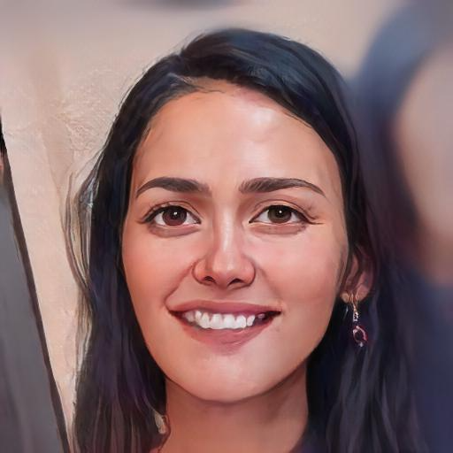

  

   

# Exergue

> L’Humanité est à un tournant de son histoire. La masse des données acquises est formidable. Il faut de nouveaux instruments pour les simplifier, les condenser ou jamais l’intelligence ne saura ni surmonter les difficultés qui l’accablent, ni réaliser les progrès qu’elle entrevoit et auxquels elle aspire." - Paul Otlet, *Traité de Documentation*, 1934

> Le but 3 infonum, ça va *données* !

# Édito : la preuve par trois

Bienvenue à vous tous, qui vous apprêtez à entamer votre troisième année du Bachelor Universitaire de Technologie en Information Numérique dans les Organisations. Voici quelques mots pour vous accompagner dans cette nouvelle étape de votre parcours universitaire.

 Cette troisième année est celle de la concrétisation, de la réussite au diplôme de Bachelor. Vous allez être les premiers à vivre la formation en trois ans et sa diplomation à ce niveau.

L'année est exigeante tant en termes de compétences à acquérir, de logiciels à découvrir, de méthodes à maîtriser et de projets à réussir.

Si certains et notamment certaines vont pouvoir vivre une première année en alternance, les autres ne vont pas s'ennuyer également.

L'année comporte une forte dimension évènementielle avec trois temps forts dédiés (un *hackathon*, un nouveau *challenge* et une *exposition*), ce qui implique d'évidents enjeux de visibilité.

Cette troisième année sera *exigeante, stimulante et passionnante*. Elle vous demandera de l'*engagement*, de la *curiosité*, de l'*ouverture d'esprit*. Elle sera également source de satisfaction, de découvertes, de rencontres. Elle vous permettra de vous affirmer en tant que professionnels, de vous épanouir en tant qu'individus et en tant que collectif.
  
Si je parle de preuve, c'est aussi parce qu'il s'agit bien de documenter vos compétences et d'en faire la démonstration voire la monstration. En effet, l'année finale repose aussi sur votre capacité à construire un portfolio de tout ce que vous avez appris et de tout ce que vous savez faire. Ce sera l'occasion de vous mettre en valeur ainsi que de valoriser votre formation.Preuve aussi, car souvent il vous faudra trouver, retrouver, recouper, investiguer pour réussir vos projets et construire des démonstrations convaincantes.

Je suis persuadé que vous allez faire de cette troisième année une réussite, une étape marquante de votre parcours universitaire et professionnel.

Alors, bienvenue dans cette troisième année du BUT Information Numérique dans les Organisations. Bienvenue dans cette aventure. Ensemble, faisons la preuve par trois!

  
*Olivier Le Deuff, responsable de la troisième année*

  

# Mise au point réglementaire

  
Le fonctionnement demeure celui que vous avez connu précédemment.

  
Le règlement intérieur sera appliqué strictement cette année. Concernant la gestion des absences, il est important de noter que les étudiants sont désormais entièrement responsables de fournir leurs justificatifs dans les 48H. Le secrétariat ne fera plus de rappels à ce sujet.

Mettez-vous tout simplement dans la peau d'un travailleur qui doit justifier ses absences auprès de son employeur.

De plus, nous avons instauré une nouvelle règle selon laquelle les étudiants arrivant avec plus de 10 minutes de retard ne seront pas admis en cours. Ils devront attendre la pause ou le prochain cours pour entrer.

La délivrance du diplôme en fin de parcours atteste de ce type de compétences professionnelles que sont l'assiduité et le respect des échéances.

# Les enseignements
 

Comme les années précédentes, vous allez retrouver des contenus d'enseignement répartis entre *Ressources* et *Saé*.
 

Votre semestre 5 est riche en contenus d'enseignement et temps d'apprentissage. Le semestre 6 diminue légèrement en ressources pour faire la part belle aux projets individuels et collectifs.
Vous pouvez également naviguer dans votre année avec [le graphe de la formation](https://oledeuff.github.io/BUT-Infonum-3/graphe.html)

Vous apprendrez durant l'année à faire des réalisations du même type notamment en utilisant le logiciel *Cosma*.

  

## Les contenus des ressources

Les ressources désignent en fait ce qu'on nomme plus communément des *cours*. Comme montré sur le graphe, tous les cours, les projets et les Saé sont liés. Il faut donc bien penser à réinvestir les connaissances et les compétences d'un cours à l'autre.

## **Premier Semestre**

  
### R5. 01 Sciences de l'information et de la communication. *N. Pinède* 

Vous aviez précédemment étudié des courants qui étudient les processus informationnels et communicationnels en voyant les courants fondateurs en première année et étudié quelques textes en seconde année avec une poursuite du cours sur l'histoire récente des médias. La troisième année se poursuit sur des études de textes et de travaux ancrés sur les questions numériques.
  
### R5. 02 Initiation aux relations et à la communication interculturelles. *C. Dubois* 

La ressource "communication interculturelle" vise à aborder la communication entre des cultures et des groupes sociaux différents. Les normes de communication sont des expressions des valeurs de chaque culture et la notion de culture s'applique à tout groupe social, organisation, entreprise, communauté, école, université, équipe. L'objectif de la ressource est ainsi d'apprendre à décrypter différents modes de communication et améliorer ainsi les interactions.

### R5. 03 Responsabilité sociale des organisations. *O. Le Deuff* 

Ce cours offre une introduction approfondie à l'éthique et à la responsabilité sociale dans les organisations, mettant l'accent sur le contexte numérique. Il explore d'abord la place et l'importance de l'éthique dans les organisations et examine les questions de greenwashing. Il se penche ensuite sur la responsabilité algorithmique, abordant les biais algorithmiques et les principes éthiques de l'IA. Le concept de souveraineté numérique est ensuite étudié, suivi de l'examen de la frugalité numérique. Le cours se termine par une exploration des manipulations attentionnelles et des interfaces contraignantes. Des études de cas sont analysées pour intégrer ces concepts théoriques dans des situations réelles.

  
### R5. 04 PPP. *O. Le Deuff* 

Comme les années précédentes, le cours est dédié à votre projet personnel et professionnel. Des temps spécifiques seront dédiés notamment afin d'envisager la construction d'un portfolio de type numérique qui puisse être une vitrine de vos compétences.

### R5. 05 Data et documents. *C. Borel et S. Lapoix* 
 

Sylvain Lapoix consacrera deux jours à vous former à R et Rstudio tandis que vous apprendrez à développer votre culture graphique et votre capacité à produire des visualisations de données avec Clément Borel.

### R5. 06 Pratiques collaboratives et partage des connaissances. *A. Blanchard* 

 
Le cours vise à développer des compétences en matière de collaboration et de partage de connaissances. Le programme comprend l'apprentissage du décloisonnement de l'information via des méthodes de "corporate hacking", l'utilisation d'Obsidian et Notion pour créer des notes programmables et reproductibles, et l'application d'Airtable pour structurer les données. Les sessions couvrent également des exemples pratiques et des retours d'expérience sur des outils spécifiques.
  
### R5.07 Architecture de l'information. *O. Le Deuff* 

 
Ce cours en architecture de l'information offre une introduction aux aspects professionnels et scientifiques du domaine, avec un accent sur la conceptualisation du projet, l'étude des usagers, le maquettage des dispositifs et la réalisation de la solution technique. Il couvre divers sujets, y compris l'organologie d'un site web, l'expérience utilisateur (UX), la gestion d'un projet en architecture de l'information, la relation au design d'information, l'organisation et la classification de l'information, ainsi que les aspects trans et transmédia.
Un temps spécifique sera consacré à l'organisation des données et à la production de *data papers* afin de pouvoir répondre à certaines exigences des projets et notamment le *challenge de la data*

### R5.08 Stratégies de veille collaborative. *C. Deschamps* 

Ce cours vise à vous perfectionner dans vos méthodologies en matière de veille avec l'utilisation d'outils dédiés et l'intégration des processus récents y compris ceux qui reposent sur l'IA comme ChatGpt.

### R5.09 Stratégies de communication numérique. *A. Deneuville* 

Dans ce cours, il sera question de _storytelling_ numérique et de culture Internet. Comment imaginer une stratégie de communication qui mobilise une narration transmédiale et s'adapte aux différentes plateformes de réseaux socionumériques ? Le cours sera structuré autour de la réalisation d'un projet collectif, mais on confectionnera aussi des mèmes.

### R5.10 Politique d'archivage et de conservation. *T. Hamonic*

Ce cours se divise en trois parties principales. La première partie, "L'archivage électronique, enjeux et contexte normatif", aborde les fondamentaux de la chaîne archivistique, les enjeux de l'archivage électronique et le contexte normatif, notamment le modèle OAIS. La deuxième partie, "La pérennisation de l'information numérique", traite de la représentation numérique de l'information, des métadonnées pour la pérennisation et donne des exemples concrets de stratégies de pérennisation. Enfin, la troisième partie, "Mettre en œuvre des actions d'archivage électronique", se concentre sur le traitement des données non structurées et structurées, l'analyse des processus métiers, la définition de spécifications fonctionnelles et le rôle des différents acteurs dans l'archivage électronique.

  
### R5.11 Droit de l'information. *S. Nérisson* 

 
Les processus numériques et infocommunicationnels reposent sur plusieurs textes législatifs au niveau national et international notamment européen. Du RGPD aux projets de législation sur les plateformes et les processus algorithmiques au travers du Digital Service Act, les défis juridiques qui s'annoncent sont riches et doivent retenir toute votre attention pour vous assurer d'être un professionnel de l'information et de la communication qui connaisse et maîtrise ces aspects.

### R5.12 Expérience utilisateurs et ergonomie des interfaces. *S. Caro* 

Ce cours offre une introduction à l'expérience utilisateur (UX) et au design d'interface (UI), essentiels pour la création de plateformes de partage d'information. Il explore les méthodes clés de l'UX, comme les entretiens, les tests utilisateurs, la définition de personas, les tests AB, l'idéation, l'itération et le prototypage. Les étudiants apprendront également le processus UX et découvriront différents rôles et exemples d'UI.
 

## **Second semestre**
  

### R6.01 Sciences humaines et sociales Initiation à la recherche. *N. Pinède* 

  

### R6.02 Relations et communication interculturelles. Anglais et culture anglo-saxonne. *A. Blot* 

  

### R6.03 PPP et préparation au mémoire d'activités. *O. Le Deuff* 

Le cours poursuit l'orientation du premier semestre avec la prise en compte de la rédaction de votre mémoire de fin d'études qui est lié à votre travail de stage ou d'alternance. Il s'agira notamment de comprendre comment dégager une problématique pour construire un travail sourcé et analytique sur votre activité professionnelle.
 

### R6. 04 Data et documents.  Visualisation de données. *C.Borel* 

  
### R6. 05 Pratiques collaboratives et partage des connaissances. Perfectionnement en datajournalisme. *R. Roumanos. O. Le Deuff* 
 
 

Le but ici est de poursuivre le travail d'initiation au data journalisme en produisant une petite investigation qui repose sur des données construites et analysées. Le sujet traité devra être anglé et un soin sera apporté à la rédaction et construction du récit.

### R6.06 Gestion d'un projet en architecture de l'information. *D. Pucheu* 

Ce cours se concentre sur la structuration de données autour d'un thème spécifique et la création de sites web qui vont intègrer un graphe documentaire numérique, réalisé avec le logiciel Cosma. Certaines des réalisations des étudiants pourraient être présentées lors de l'exposition.

### R6.07 Stratégies de communication multicanal.*A. Albaut* 

  

Ce cours va reposer sur plusieurs interventions de professionnels.
Antoine Albaut, ancien étudiant d'infonum, et social manager chez Atoo va intervenir sur les aspects social media et marketing.

## Les Saé et les projets

Pour les alternants, l'année sera celle d'une immersion dans la réalité professionnelle au sein d'une même organisation. Pour les autres, ce sera l'occasion de rentrer dans une diversité de situations professionnelles avec au menu toutes les étapes du processus informationnel et communicationnel.

Plusieurs temps forts sont prévus cette année qui se coupleront avec des Saé :
 

* Un premier évènement avec un *hackathon sur les algorithmes*.

* Un second grand évènement avec *le premier challenge de la data des BUT Infonum*.

* Une *exposition de datavisualisation*.

  

Les semaines d'alternance seront donc des semaines de projets ambitieux pour les étudiants de la formation initiale avec des périodes d'autonomie encadrées par des moments de formation, des ateliers, et des défenses de projets.

  

Comme vous pourrez le constater dans l'emploi du temps, ces périodes occupent une grande place dans votre année, il s'agit donc de s'y investir pleinement, car ces temps permettent de transposer les connaissances acquises durant les cours et de participer à des réalisations d'importance pour votre CV.

  

Attention : chaque projet repose sur des réalisations collectives, mais aussi sur des *réalisations individuelles* qui seront évaluées. Pensez aussi que vos travaux individuels peuvent constituer des éléments à intégrer à votre *portfolio*. À noter que le portfolio tout comme le stage constituent également une Saé.

  

Les Saé sont les suivantes et seront donc validés durant vos travaux au sein des projets: Les projets sont des moments pendant lesquels une ou plusieurs SAE sont évaluées.

  

**SAÉ 5.INFONUM.01. Mettre en place une stratégie de communication numérique**

**SAÉ 5.INFONUM.02. Accompagner les utilisateurs**

**SAÉ 5.INFONUM.03. Portfolio**

**SAÉ 6.INFONUM.01.Gérer les données**

**SAÉ 6.INFONUM.02 Réaliser un projet de communication numérique**

  
### Premier temps : Open data and co. 25-6 octobre. [Saé 5.01 et 5.02]
 

La première période de projets va vous permettre de vous familiariser avec les questions des données ouvertes. L'occasion de découvrir les enjeux de *l'open data.* Un cahier des charges précis vous sera délivré à l'occasion. Ce premier temps vous permettra d'acquérir des compétences et savoirs à mobiliser pour la suite notamment le projet suivant autour de l'exposition, mais aussi plus tard le challenge de la data.

  

### Second temps :Conception d'une exposition innovante. Semaine du 23 octobre. [Saé 5. 01]

  

L'objectif de ce temps sera de concevoir l'évènement de l'année en fonction de la demande du commanditaire.

  

L'Exposition de datavisualisation va nous mobiliser durant toute l'année. On aura la chance d'avoir un autre renfort : Sylvain Lapoix, datajournaliste, et un des créateurs du fameux _Data Gueule._

  

### Troisième temps du 20 novembre au 1er décembre. [Saé 5.02]

  

Cette période est marquée par l'organisation du Hackathon sur les algorithmes en partenariat avec l'IJBA. Une journée spécifique vous attend le **30 novembre** avec des équipes et des coachs et un jury pour déterminer quelle sera la meilleure équipe.

  

Les jours qui vont précéder l'évènement seront dédiés à la préparation pédagogique mais aussi à la préparation logistique.

  

La seconde semaine sera consacrée aux prolongements du Hackathon et à la poursuite de la préparation de l'exposition.

  

Aucun temps mort n'est prévu !

  

### Quatrième temps : du 18 au 24 décembre. Médiation des données et intelligibilité. [Saé 5.02 et 5.01]

  

Ce temps va être consacré à des enjeux de data literacy en rapport avec l'exposition.

  

On réfléchira notamment aux enjeux d'explication de ce qui va être produit, aux cibles, aux publics visés notamment aux différents types de visiteurs.

  

### Cinquième temps : 22 janvier au 2 février. Production des dataviz [Saé 6.02]

  

Il s'agit de produire l'essence même de l'exposition et de commencer à créer les documents de communication autour de l'évènement.

  
  
  

### Sixième temps. Du 19 au 23 février. Challenge de la data [SAé 6.01 ]

  

C'est le nouvel évènement phare en infonum qui s'annonce à la suite d'une idée de Nathalie Pinède et de Maryse Rizza durant la finale du challenge de la veille. Pour l'instant, deux IUT relèvent le défi. L'IUT de Bordeaux et l'IUT de Tours. On retrouvera un esprit proche du challenge de la veille si ce n'est que toutes les équipes participeront à la finale !

  

Durant cette semaine, vous serez accompagnés par vos professeurs habituels notamment Nathalie Pinède ainsi que par un spécialiste des données : Cédric Lombion.

  
### Septième temps : semaine du 18 mars [Saé 6 02]

Ce sera le temps de la préparation de l'exposition et la communication autour de l'évènement. Vous retrouverez Sylvain Lapoix qui suit le projet de bout en bout et Allan Deneuville.

  

###  Portfolio. [Saé Portfolio]

  

Cette SAE repose sur votre capacité à construire un projet professionnel cohérent qui documente toutes vos compétences. C'est un projet personnel important qui doit être pensé tout au long de l'année. Ce temps final doit vous permettre de proposer une cartographie de vos compétences avec les preuves documentaires qui en attestent.

  

### Le stage

  

**Description**

  

Le stage de troisième année, qui dure de 12 à 16 semaines, est une occasion pour vous d'appliquer les compétences que vous avez acquises pendant votre formation. Vous aurez l'opportunité de travailler sur des projets réels, nécessitant à la fois de l'indépendance et de la collaboration avec d'autres personnes. Les stages débuteront à partir du *8 avril*
Voici ce que vous pouvez attendre de ce stage :

  

1. Vous pourrez vérifier si vous avez atteint le niveau d'expertise attendu à ce stade de votre formation. Cela signifie que vous serez capable de prendre des décisions professionnelles de manière autonome, de travailler en équipe et d'évaluer et d'ajuster vos actions en fonction du contexte.

2. Vous aurez l'occasion d'acquérir de nouvelles compétences spécifiques, que ce soit dans des métiers, des techniques ou des secteurs différents de ceux que vous avez déjà expérimentés. Cela vous aidera à vous préparer pour votre futur emploi ou pour des études supplémentaires.

3. Vous apprendrez à intégrer vos actions dans une politique, une stratégie ou un processus plus large, en comprenant les enjeux et en vous y adaptant.

4. Vous aurez l'opportunité de communiquer sur vos actions, que ce soit pour améliorer la collaboration au sein de votre équipe ou pour mettre en valeur vos compétences professionnelles.

  

Ce stage est une étape importante pour finaliser votre BUT (Bachelor Universitaire de Technologie) et lui donner une orientation spécifique en fonction de votre projet professionnel. Que vous souhaitiez entrer directement sur le marché du travail ou poursuivre vos études en master, ce stage vous aidera à affiner votre parcours.

  

N'oubliez pas que, compte tenu de la durée du stage, vous devriez recevoir une gratification conformément à la réglementation. Les offres de stage que nous recevons sont souvent axées sur la documentation, l'archivistique ou les questions liées aux données.

  

Les stages pourront débuter à partir du *8 avril*.

  

### L'alternance

  
Cette année présente une nouveauté si vous avez signé un contrat d'alternance. Félicitations pour cette nouvelle étape passionnante de votre parcours académique et professionnel !
N'oubliez pas que vous êtes désormais considérés comme des salariés à part entière, avec toutes les responsabilités que cela implique. C'est une opportunité à saisir pour faire preuve de professionnalisme et de vous investir durablement au sein du monde professionnel.
  

Vous ne pourrez pas participer aux projets, car vous allez être bien occupés dans vos fonctions respectives et qu'ils se déroulent pendant que vous êtes justement sur vos lieux de travail.
 
### Logiciels et outils

Pour réussir votre année, il est conseillé de disposer de votre propre équipement informatique. Bien que l'IUT mette à disposition des ordinateurs, il peut vous être suggéré d'installer certains logiciels sur vos appareils personnels. La majorité de ces logiciels sont gratuits et open source, et il est important de commencer à les utiliser de manière professionnelle et régulière.

           

  
# Table des matières
* TOC
{:toc}

#### Crédits
Image de couverture: Dall-E avec un prompt modifié par ChatGpt 4
Site généré par Github Jekyll

