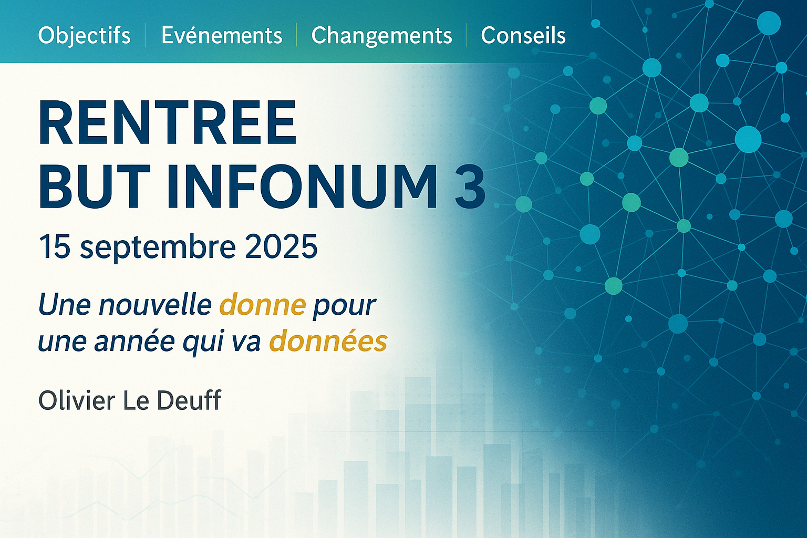
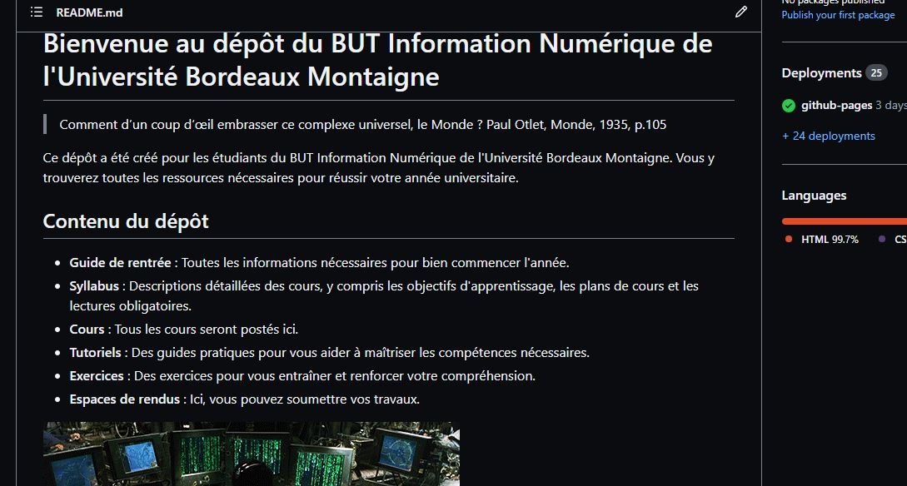

---

**Objectifs** | Evènements | Changements | Conseils
## Une nouvelle ambition
- Seconde mouture de la troisième année
- Un esprit proche de l'ancienne *LP MIND*
- Un ancrage plus professionnel
    - de nouveaux intervenants professionnels dans la formation
    - des projets ambitieux
  
---
**Objectifs** | Evènements | Changements | Conseils
## Une ambition orientée "données"
- Découverte et immersion dans l'open data
- Un début de maîtrise des processus de traitement des données
- Une formation outillée et technique.
    - il faut s'équiper niveau matériel informatique.
- Une progression dans la capacité à organiser et documenter les processus
- Une volonté de communiquer et de visualiser les données produites.

---
**Objectifs** | Evènements | Changements | Conseils
## De nouveaux objectifs
- La troisième année n'est pas qu'une simple année de perfectionnement
- Il y a clairement de nouveaux apprentissages
- Un spectre de compétences en information-communication élargie
- Une dimension réflexive, critique et opérable
    - vers des logiques de communication plus durable et plus éthique
    - une intégration réfléchie de l'IA dans les pratiques.
    - NOUVEAUTE : une conservation et réutilisation des données produites dans chaque projet

---
✓Objectifs| **Evènements**| Changements | Conseils
# Construire des projets innovants

## Des défis
- Des projets
- Des *évènements*
- Des *livrables*
- Des *succès*
- Des *déceptions* ?

---
✓Objectifs | **Evènements** | Changements | Conseils
## Les évènements
- L'*Open data university* (semaine du 6 au 10 octobre. non-alternants)
- L'*exposition dataviz* sur des données musicales sur les deux semestres durant les semaines projets avec #David Pucheu
- Le projet Saé *surprise*
- le *challenge de la data* avec l'IUT de Tours à Tours en mars 2026.

---
✓Objectifs** | ✓Evènements | **Changements** | Conseils

## Un gros investissement
- Personnel
- et collectif
    - qu'il faudra démontrer et prouver
- Il faut vraiment se **donner** le temps de progresser
- Une logique professionnelle
- Une capacité à progresser.

---
✓Objectifs | ✓Evènements | **Changements**| Conseils
## Des changements méthodologiques et organisationnels
- Intégration progressive de Github dans votre pratique.
- Il va falloir penser "données" et réutilisation.

---
✓Objectifs| ✓Evènements | **Changements** | Conseils

## Présentation des nouveaux outils et du guide
[Visitez le site GitHub](https://github.com/oledeuff/BUT-Infonum-3)

---
✓Objectifs| ✓Evènements |✓Changements | **Conseils**
- Bien suivre les consignes
- Bien anticiper :
    - les *échéances* des *livrables*
    - les *étapes* de votre année
        - les *évènements*
        - votre *orientation* (**Mon Master**)
        - votre *stage* ou la réussite de votre alternance
        - votre *portofolio*
        - la *soutenance finale*

---
✓Objectifs| ✓Evènements |✓Changements | **Conseils**
- Bien débuter l'année permet une bonne *progression*
- Développer et démontrer des *compétences techniques*
- Faire des *efforts* apportent vraiment une *satisfaction*

---
✓Objectifs| ✓Evènements |✓Changements | **Conseils**
 # Donner du sens à votre formation
 - la 3a permet de relier tout le spectre de l'infocom
 - On va *du plut petit élément informationnel*, la donnée..
 - Aux *plus grandes réalisations communicationnelles*.

---
✓Objectifs| ✓Evènements |✓Changements | **Conseils**
# Votre meilleure année 
- Travaillez, progressez, profitez

---

# Merci de votre attention

--- 
## Crédits
Illustrations : Dall-e 

